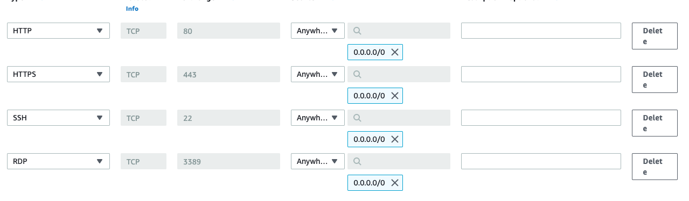
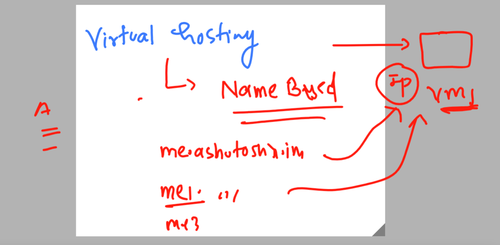
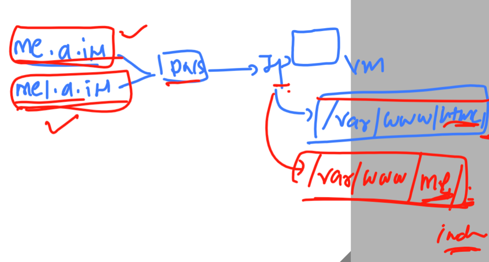

## Getting started

## apache httpd web server 

### Official Documentation

[Click Here](https://httpd.apache.org/docs/2.4/)

### Learning Sources 


### creating firewall rules for apache httpd linux vm 



### connecting linux vm using ssh 

```
fire@ashutoshhs-MacBook-Air Downloads % ssh -i  ashu-apache-access.pem   ec2-user@3.145.176.176
The authenticity of host '3.145.176.176 (3.145.176.176)' can't be established.
ECDSA key fingerprint is SHA256:vowYQXM5ryNReLwxKtMt9QXvbDm3vCA5B5yO7dcAl2w.
Are you sure you want to continue connecting (yes/no/[fingerprint])? yes
Warning: Permanently added '3.145.176.176' (ECDSA) to the list of known hosts.
@@@@@@@@@@@@@@@@@@@@@@@@@@@@@@@@@@@@@@@@@@@@@@@@@@@@@@@@@@@
@         WARNING: UNPROTECTED PRIVATE KEY FILE!          @
@@@@@@@@@@@@@@@@@@@@@@@@@@@@@@@@@@@@@@@@@@@@@@@@@@@@@@@@@@@
Permissions 0644 for 'ashu-apache-access.pem' are too open.
It is required that your private key files are NOT accessible by others.
This private key will be ignored.
Load key "ashu-apache-access.pem": bad permissions
ec2-user@3.145.176.176: Permission denied (publickey,gssapi-keyex,gssapi-with-mic).
fire@ashutoshhs-MacBook-Air Downloads % 
fire@ashutoshhs-MacBook-Air Downloads % chmod  400  ashu-apache-access.pem 
fire@ashutoshhs-MacBook-Air Downloads % 
fire@ashutoshhs-MacBook-Air Downloads % 
fire@ashutoshhs-MacBook-Air Downloads % ssh -i  ashu-apache-access.pem   ec2-user@3.145.176.176

       __|  __|_  )
       _|  (     /   Amazon Linux 2 AMI
      ___|\___|___|

https://aws.amazon.com/amazon-linux-2/
6 package(s) needed for security, out of 7 available
Run "sudo yum update" to apply all updates.
-bash: warning: setlocale: LC_CTYPE: cannot change locale (UTF-8): No such file or directory
[ec2-user@ip-172-31-13-105 ~]$ 
[ec2-user@ip-172-31-13-105 ~]$ uname -r
5.10.179-166.674.amzn2.x86_64

```

### checking os name 

```
ec2-user@ip-172-31-13-105 ~]$ uname -r
5.10.179-166.674.amzn2.x86_64
[ec2-user@ip-172-31-13-105 ~]$ 
[ec2-user@ip-172-31-13-105 ~]$ cat  /etc/os-release 
NAME="Amazon Linux"
VERSION="2"
ID="amzn"
ID_LIKE="centos rhel fedora"
VERSION_ID="2"
PRETTY_NAME="Amazon Linux 2"
ANSI_COLOR="0;33"
CPE_NAME="cpe:2.3:o:amazon:amazon_linux:2"
HOME_URL="https://amazonlinux.com/"
[ec2-user@ip-172-31-13-105 ~]$ 

```

## Installing apache httpd 

### checking rpm package status of httpd 
```
[ec2-user@ip-172-31-13-105 ~]$ rpm   -q  httpd
package httpd is not installed
[ec2-user@ip-172-31-13-105 ~]$ 

```

### installing httpd with sudo power without root access

```
[ec2-user@ip-172-31-13-105 ~]$ sudo yum install httpd 
Failed to set locale, defaulting to C
Loaded plugins: extras_suggestions, langpacks, priorities, update-motd
Resolving Dependencies
--> Running transaction check
---> Package httpd.x86_64 0:2.4.57-1.amzn2 will be installed
--> Processing Dependency: httpd-tools = 2.4.57-1.amzn2 for package: httpd-2.4.57-1.amzn2.x86_64
--> Processing Dependency: httpd-filesystem = 2.4.57-1.amzn2 for package: httpd-2.4.57-1.amzn2.x86_64
--> Processing Dependency: system-logos-httpd for package: htt
Package                     Arch           Version                       Repository          Size
===================================================================================================
Installing:
 httpd                       x86_64         2.4.57-1.amzn2                amzn2-core         1.4 M
Installing for dependencies:
 apr                         x86_64         1.7.2-1.amzn2                 amzn2-core         130 k
 apr-util                    x86_64         1.6.3-1.amzn2.0.1             amzn2-core         101 k
 apr-util-bdb                x86_64         1.6.3-1.amzn2.0.1             amzn2-core          22 k
 generic-logos-httpd         noarch         18.0.0-4.amzn2                amzn2-core          19 k
 httpd-filesystem            noarch         2.4.57-1.amzn2                amzn2-core          24 k
 httpd-tools                 x86_64         2.4.57-1.amzn2                amzn2-core          88 k
 mailcap                     noarch         2.1.41-2.amzn2                amzn2-core          31 k
 mod_http2                   x86_64         1.15.19-1.amzn2.0.1           amzn2-core         149 k

Transaction Summary
===================================================================================================
Install  1 Package (+8 Dependent packages)

Total download size: 1.9 M
Installed size: 5.2 M
Is this ok [y/d/N]: y

```

lets verify it 

```
[ec2-user@ip-172-31-13-105 ~]$ sudo yum install httpd 
Failed to set locale, defaulting to C
Loaded plugins: extras_suggestions, langpacks, priorities, update-motd
Package httpd-2.4.57-1.amzn2.x86_64 already installed and latest version
Nothing to do
[ec2-user@ip-172-31-13-105 ~]$ 
[ec2-user@ip-172-31-13-105 ~]$ 
[ec2-user@ip-172-31-13-105 ~]$ rpm  -q httpd
httpd-2.4.57-1.amzn2.x86_64

```

## Configuration of apache httpd on RHEL / amazon linux 

### checking configuration files 

```
[ec2-user@ip-172-31-13-105 ~]$ rpm -qc    httpd
/etc/httpd/conf.d/autoindex.conf
/etc/httpd/conf.d/userdir.conf
/etc/httpd/conf.d/welcome.conf
/etc/httpd/conf.modules.d/00-base.conf
/etc/httpd/conf.modules.d/00-dav.conf
/etc/httpd/conf.modules.d/00-lua.conf
/etc/httpd/conf.modules.d/00-mpm.conf
/etc/httpd/conf.modules.d/00-optional.conf
/etc/httpd/conf.modules.d/00-proxy.conf
/etc/httpd/conf.modules.d/00-systemd.conf
/etc/httpd/conf.modules.d/01-cgi.conf
/etc/httpd/conf/httpd.conf
/etc/httpd/conf/magic
/etc/logrotate.d/httpd
/etc/sysconfig/htcacheclean
[ec2-user@ip-172-31-13-105 ~]$ 

```

### main configuration file 

```
/etc/httpd/conf/httpd.conf
```

### lets explore main configuration file 

```
port is 80
user and group is apache 
/var/www/html/ is default webapp route 
index.html is the name of default page
```

### checking syntax of  configuration 

```
[ec2-user@ip-172-31-13-105 ~]$ httpd -t
Syntax OK
```

### lets start the service of httpd 

```
[ec2-user@ip-172-31-13-105 ~]$ sudo  systemctl  start  httpd
[ec2-user@ip-172-31-13-105 ~]$ sudo  systemctl  status   httpd
● httpd.service - The Apache HTTP Server
   Loaded: loaded (/usr/lib/systemd/system/httpd.service; disabled; vendor preset: disabled)
   Active: active (running) since Sat 2023-06-03 07:07:56 UTC; 6s ago
     Docs: man:httpd.service(8)
 Main PID: 32752 (httpd)
   Status: "Processing requests..."
   CGroup: /system.slice/httpd.service

```

### CREATe web page named index.html under /var/www/html/

```
[ec2-user@ip-172-31-13-105 ~]$ cd /var/www/html/
[ec2-user@ip-172-31-13-105 html]$ ls
[ec2-user@ip-172-31-13-105 html]$ sudo  vim   index.html 
[ec2-user@ip-172-31-13-105 html]$ cat  index.html 
Hello apache httpd  
This is me Ashutoshh singh 
[ec2-user@ip-172-31-13-105 html]$ 
```

### lets access the web page using any browser -- http://ip

### setting auto-start option for httpd service 

```
sudo systemctl enable  httpd
Created symlink from /etc/systemd/system/multi-user.target.wants/httpd.service to /usr/lib/systemd/system/httpd.service.

```

### configuration of Virtaul hosting -- Namebased hosting 



### more concept about Virtual hosting 



### taking two sample website from github 

```
[ec2-user@ip-172-31-13-105 ~]$ cd /var/www/html/
[ec2-user@ip-172-31-13-105 html]$ ls
index.html
[ec2-user@ip-172-31-13-105 html]$ sudo rm index.html 
[ec2-user@ip-172-31-13-105 html]$ ls
[ec2-user@ip-172-31-13-105 html]$ 
[ec2-user@ip-172-31-13-105 html]$ cd  
[ec2-user@ip-172-31-13-105 ~]$ ls
[ec2-user@ip-172-31-13-105 ~]$ 
[ec2-user@ip-172-31-13-105 ~]$ git clone  https://github.com/microsoft/project-html-website.git
-bash: git: command not found
[ec2-user@ip-172-31-13-105 ~]$ sudo yum install git -y &>/dev/null 
[ec2-user@ip-172-31-13-105 ~]$ 
[ec2-user@ip-172-31-13-105 ~]$ git clone  https://github.com/microsoft/project-html-website.git
Cloning into 'project-html-website'...
remote: Enumerating objects: 24, done.
remote: Counting objects: 100% (5/5), done.
remote: Compressing objects: 100% (5/5), done.
remote: Total 24 (delta 0), reused 3 (delta 0), pack-reused 19
Receiving objects: 100% (24/24), 465.86 KiB | 6.29 MiB/s, done.
[ec2-user@ip-172-31-13-105 ~]$ ls
project-html-website
[ec2-user@ip-172-31-13-105 ~]$ git clone https://github.com/schoolofdevops/html-sample-app.git
Cloning into 'html-sample-app'...
remote: Enumerating objects: 74, done.
remote: Counting objects: 100% (74/74), done.
remote: Compressing objects: 100% (69/69), done.
remote: Total 74 (delta 5), reused 72 (delta 5), pack-reused 0
Receiving objects: 100% (74/74), 1.38 MiB | 10.47 MiB/s, done.
Resolving deltas: 100% (5/5), done.
[ec2-user@ip-172-31-13-105 ~]$ ls
html-sample-app  project-html-website
[ec2-user@ip-172-31-13-105 ~]$ 

```

### there are web app we cloned 

### copy the first one to /var/www/html/ folder

```
ec2-user@ip-172-31-13-105 ~]$ ls
html-sample-app  project-html-website
[ec2-user@ip-172-31-13-105 ~]$ 
[ec2-user@ip-172-31-13-105 ~]$ sudo cp  -rf  html-sample-app/*   /var/www/html/
[ec2-user@ip-172-31-13-105 ~]$ 
[ec2-user@ip-172-31-13-105 ~]$ 
[ec2-user@ip-172-31-13-105 ~]$ 
[ec2-user@ip-172-31-13-105 ~]$ ls  /var/www/html/
LICENSE.txt  assets         generic.html         images
README.txt   elements.html  html5up-phantom.zip  index.html
[ec2-user@ip-172-31-13-105 ~]$ 


```

### create a new folder and copy content there of second webapp

```
[ec2-user@ip-172-31-13-105 ~]$ sudo   mkdir  /var/www/me1
[ec2-user@ip-172-31-13-105 ~]$ 
[ec2-user@ip-172-31-13-105 ~]$ ls
html-sample-app  project-html-website
[ec2-user@ip-172-31-13-105 ~]$ sudo cp -rf  project-html-website/*   /var/www/me1/
[ec2-user@ip-172-31-13-105 ~]$ 
[ec2-user@ip-172-31-13-105 ~]$ ls /var/www/me1/
LICENSE  README.md  SECURITY.md  css  fonts  img  index.html
[ec2-user@ip-172-31-13-105 ~]$ 


```

### Lets configure apache httpd to map virtual hosting 

```
ec2-user@ip-172-31-13-105 ~]$ rpm  -qc  httpd
/etc/httpd/conf.d/autoindex.conf
/etc/httpd/conf.d/userdir.conf
/etc/httpd/conf.d/welcome.conf
/etc/httpd/conf.modules.d/00-base.conf
/etc/httpd/conf.modules.d/00-dav.conf
/etc/httpd/conf.modules.d/00-lua.conf
/etc/httpd/conf.modules.d/00-mpm.conf
/etc/httpd/conf.modules.d/00-optional.conf
/etc/httpd/conf.modules.d/00-proxy.conf
/etc/httpd/conf.modules.d/00-systemd.conf
/etc/httpd/conf.modules.d/01-cgi.conf
/etc/httpd/conf/httpd.conf
/etc/httpd/conf/magic
/etc/logrotate.d/httpd
/etc/sysconfig/htcacheclean
[ec2-user@ip-172-31-13-105 ~]$ cd  /etc/httpd/conf
conf/           conf.d/         conf.modules.d/ 
[ec2-user@ip-172-31-13-105 ~]$ cd  /etc/httpd/conf.d/
[ec2-user@ip-172-31-13-105 conf.d]$ ls
README  autoindex.conf  userdir.conf  welcome.conf
[ec2-user@ip-172-31-13-105 conf.d]$ 


```


### lets create conf files 

```
[ec2-user@ip-172-31-13-105 ~]$ cd  /etc/httpd/conf.d/
[ec2-user@ip-172-31-13-105 conf.d]$ ls
README  autoindex.conf  userdir.conf  welcome.conf

[ec2-user@ip-172-31-13-105 conf.d]$ sudo  touch   me.conf  me1.conf 
[ec2-user@ip-172-31-13-105 conf.d]$ ls
README  autoindex.conf  me.conf  me1.conf  userdir.conf  welcome.conf
[ec2-user@ip-172-31-13-105 conf.d]$ 


```

### content of me.conf 

```
<Virtualhost *:80>
	servername me.ashutoshh.in
	documentroot /var/www/html/
</Virtualhost>
```

### me1.conf

```
<Virtualhost *:80>
	servername me1.ashutoshh.in
	documentroot /var/www/me1/
</Virtualhost>
```


