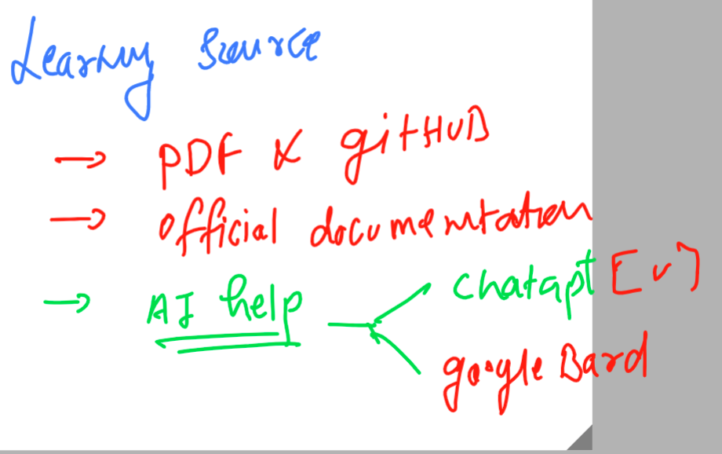

## Getting started

## apache httpd web server 

### Official Documentation

[Click Here](https://httpd.apache.org/docs/2.4/)

### Learning Sources 



### creating firewall rules for apache httpd linux vm 


### connecting linux vm using ssh 

```
fire@ashutoshhs-MacBook-Air Downloads % ssh -i  ashu-apache-access.pem   ec2-user@3.145.176.176
The authenticity of host '3.145.176.176 (3.145.176.176)' can't be established.
ECDSA key fingerprint is SHA256:vowYQXM5ryNReLwxKtMt9QXvbDm3vCA5B5yO7dcAl2w.
Are you sure you want to continue connecting (yes/no/[fingerprint])? yes
Warning: Permanently added '3.145.176.176' (ECDSA) to the list of known hosts.
@@@@@@@@@@@@@@@@@@@@@@@@@@@@@@@@@@@@@@@@@@@@@@@@@@@@@@@@@@@
@         WARNING: UNPROTECTED PRIVATE KEY FILE!          @
@@@@@@@@@@@@@@@@@@@@@@@@@@@@@@@@@@@@@@@@@@@@@@@@@@@@@@@@@@@
Permissions 0644 for 'ashu-apache-access.pem' are too open.
It is required that your private key files are NOT accessible by others.
This private key will be ignored.
Load key "ashu-apache-access.pem": bad permissions
ec2-user@3.145.176.176: Permission denied (publickey,gssapi-keyex,gssapi-with-mic).
fire@ashutoshhs-MacBook-Air Downloads % 
fire@ashutoshhs-MacBook-Air Downloads % chmod  400  ashu-apache-access.pem 
fire@ashutoshhs-MacBook-Air Downloads % 
fire@ashutoshhs-MacBook-Air Downloads % 
fire@ashutoshhs-MacBook-Air Downloads % ssh -i  ashu-apache-access.pem   ec2-user@3.145.176.176

       __|  __|_  )
       _|  (     /   Amazon Linux 2 AMI
      ___|\___|___|

https://aws.amazon.com/amazon-linux-2/
6 package(s) needed for security, out of 7 available
Run "sudo yum update" to apply all updates.
-bash: warning: setlocale: LC_CTYPE: cannot change locale (UTF-8): No such file or directory
[ec2-user@ip-172-31-13-105 ~]$ 
[ec2-user@ip-172-31-13-105 ~]$ uname -r
5.10.179-166.674.amzn2.x86_64

```


