## Getting started

### Revision 

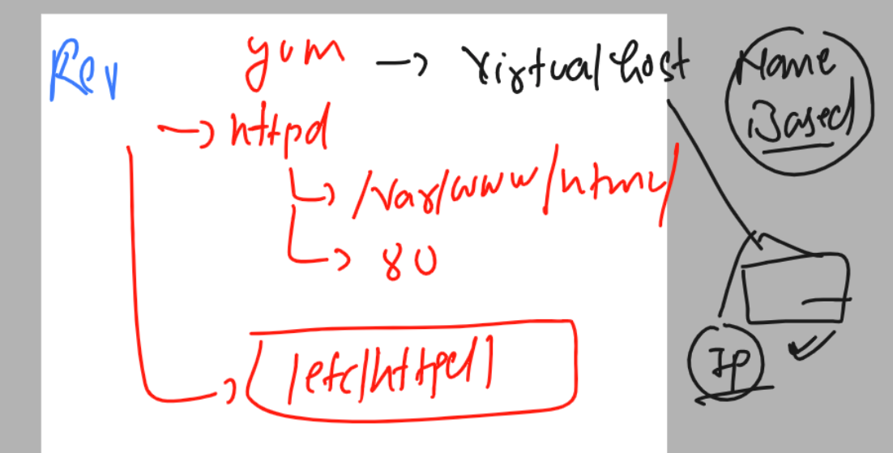

### target for the day 

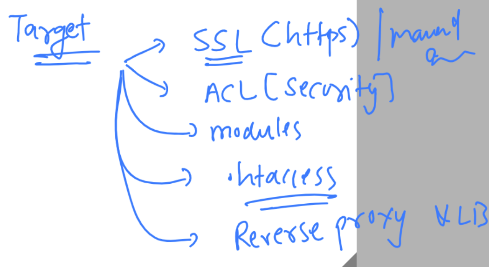

### check as per previous configuration 

```
[ec2-user@ip-172-31-13-105 ~]$ whoami
ec2-user
[ec2-user@ip-172-31-13-105 ~]$ sudo -i
[root@ip-172-31-13-105 ~]# rpm -q httpd
httpd-2.4.57-1.amzn2.x86_64
[root@ip-172-31-13-105 ~]# systemctl status httpd
● httpd.service - The Apache HTTP Server
   Loaded: loaded (/usr/lib/systemd/system/httpd.service; enabled; vendor preset: disabled)
   Active: active (running) since Fri 2023-06-09 03:23:56 UTC; 1h 11min ago
     Docs: man:httpd.service(8)
 Main PID: 2954 (httpd)
   Status: "Total requests: 14; Idle/Busy workers 100/0;Requests/sec: 0.00325; Bytes served/sec:   3 B/sec"
   CGroup: /system.slice/httpd.service

```

## ACL is httpd 

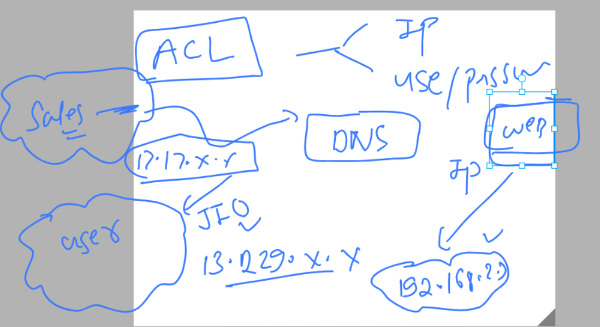

### features like ACL can be implemented in httpd using Module concept 


### info about modules 

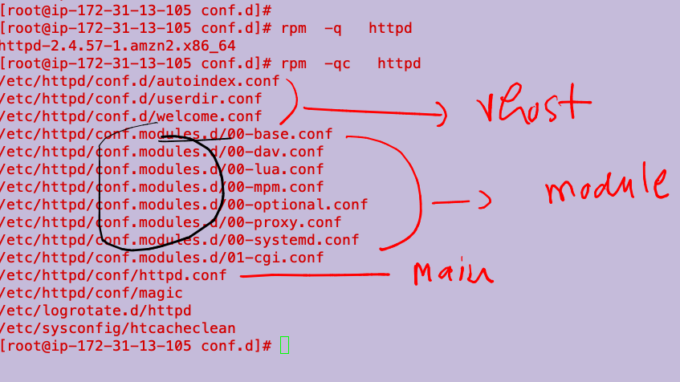

### checking modules configuration files 

```
[root@ip-172-31-13-105 conf.d]# cd  /etc/httpd/
[root@ip-172-31-13-105 httpd]# ls
conf  conf.d  conf.modules.d  logs  modules  run  state
[root@ip-172-31-13-105 httpd]# 
[root@ip-172-31-13-105 httpd]# 
[root@ip-172-31-13-105 httpd]# cd  conf.
conf.d/         conf.modules.d/ 
[root@ip-172-31-13-105 httpd]# cd  conf.modules.d/
[root@ip-172-31-13-105 conf.modules.d]# ls
00-base.conf  00-lua.conf  00-optional.conf  00-systemd.conf  10-h2.conf        README
00-dav.conf   00-mpm.conf  00-proxy.conf     01-cgi.conf      10-proxy_h2.conf
[root@ip-172-31-13-105 conf.modules.d]# 
```

### by default all the modules are stored in given location 

```
[root@ip-172-31-13-105 conf.modules.d]# cd  /etc/httpd/
[root@ip-172-31-13-105 httpd]# ls
conf  conf.d  conf.modules.d  logs  modules  run  state
[root@ip-172-31-13-105 httpd]# cd modules/
[root@ip-172-31-13-105 modules]# ls
mod_access_compat.so    mod_cgid.so                 mod_log_config.so      mod_ratelimit.so
mod_actions.so          mod_charset_lite.so         mod_log_debug.so       mod_reflector.so
mod_alias.so            mod_data.so                 mod_log_forensic.so    mod_remoteip.so
mod_allowmethods.so     mod_dav.so                  mod_logio.so           mod_reqtimeout.so
mod_asis.so             mod_dav_fs.so               mod_lua.so             mod_request.so
mod_auth_basic.so       mod_dav_lock.so             mod_macro.so           mod_rewrite.so
```

### you can also check list of loaded modules 

```
[root@ip-172-31-13-105 modules]# httpd -M  
Loaded Modules:
 core_module (static)
 so_module (static)
 http_module (static)
 access_compat_module (shared)
```

## ACL in httpd modules names are changing 2.2 to 2.4 

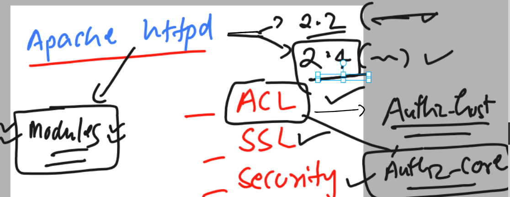

### checking modules 

```
[root@ip-172-31-13-105 conf.modules.d]# httpd -M  |  grep -i authz_host
 authz_host_module (shared)
[root@ip-172-31-13-105 conf.modules.d]# httpd -M  |  grep -i authz_core
 authz_core_module (shared)
[root@ip-172-31-13-105 conf.modules.d]# httpd -M  |  grep -i authz_
 authz_core_module (shared)
 authz_dbd_module (shared)
 authz_dbm_module (shared)
 authz_groupfile_module (shared)
 authz_host_module (shared)
 authz_owner_module (shared)
 authz_user_module (shared)
[root@ip-172-31-13-105 conf.modules.d]# 


```

### doing acl in vhost 

```
[root@ip-172-31-13-105 conf.modules.d]# cd  /etc/httpd/
[root@ip-172-31-13-105 httpd]# ls
conf  conf.d  conf.modules.d  logs  modules  run  state
[root@ip-172-31-13-105 httpd]# cd  conf.d/
[root@ip-172-31-13-105 conf.d]# ls
README  autoindex.conf  me.conf  me1.conf  userdir.conf  welcome.conf
[root@ip-172-31-13-105 conf.d]# cat  me.conf 
<Virtualhost *:80>
	servername me.ashutoshh.in
	documentroot /var/www/html/
</Virtualhost>
[root@ip-172-31-13-105 conf.d]# vim me.conf 
[root@ip-172-31-13-105 conf.d]# vim me.conf 
[root@ip-172-31-13-105 conf.d]# cat  me.conf 
<Virtualhost *:80>
	servername ok.ashutoshh.in
	documentroot /var/www/html/
# use the style of authz_host which will work in 2.2 & 2.4 both 
	<directory  /var/www/html/>
		order allow,deny
		allow from 192.168.2.100  10.10.0.0/24 
		deny from all
	</directory>
</Virtualhost>

```
### checking syntax 

```
[root@ip-172-31-13-105 conf.d]# httpd -t
Syntax OK

```

### loading apache httpd service 

```
[root@ip-172-31-13-105 conf.d]# systemctl reload httpd
[root@ip-172-31-13-105 conf.d]# systemctl status  httpd
● httpd.service - The Apache HTTP Server
   Loaded: loaded (/usr/lib/systemd/system/httpd.service; enabled; vendor preset: disabled)
   Active: active (running) since Fri 2023-06-09 04:40:11 UTC; 42min ago
     Docs: man:httpd.service(8)

```

### changing order can work 

```
<Virtualhost *:80>
	servername ok.ashutoshh.in
	documentroot /var/www/html/
# use the style of authz_host which will work in 2.2 & 2.4 both 
	<directory  /var/www/html/>
		order deny,allow
		deny from 192.168.2.100  10.10.0.0/24 
		allow from all
	</directory>
</Virtualhost>

```

### Extending more acl cases 

### creating sub pages in /var/www/html/

```
[root@ip-172-31-13-105 conf.d]# cd /var/www/html/
[root@ip-172-31-13-105 html]# ls
LICENSE.txt  README.txt  assets  elements.html  generic.html  html5up-phantom.zip  images  index.html
[root@ip-172-31-13-105 html]# 
[root@ip-172-31-13-105 html]# 
[root@ip-172-31-13-105 html]# mkdir  secure  test 
[root@ip-172-31-13-105 html]# ls
LICENSE.txt  README.txt  assets  elements.html  generic.html  html5up-phantom.zip  images  index.html  secure  test
[root@ip-172-31-13-105 html]# vim secure/index.html 
[root@ip-172-31-13-105 html]# vim test/index.html 
[root@ip-172-31-13-105 html]# ls  secure/   test/
secure/:
index.html

test/:
index.html
[root@ip-172-31-13-105 html]# 
```


## alternative of Virtaulhost conf is  documentroot based configuration -- using .htaccess 

### we can have config of  /var/www/html/. location in the same folder by then name of .htaccess 

```

[root@ip-172-31-13-105 html]# cat  /etc/httpd/conf.d/me.conf 
<Virtualhost *:80>
	servername ok.ashutoshh.in
	documentroot /var/www/html/
# use the style of authz_host which will work in 2.2 & 2.4 both 
	<directory  /var/www/html/>
		AllowOverride all
		require all granted
	</directory>
</Virtualhost>


[root@ip-172-31-13-105 html]# 
[root@ip-172-31-13-105 html]# cd /var/www/html/
[root@ip-172-31-13-105 html]# cat .htaccess 
order deny,allow
deny from 127.0.0.1 10.0.0.0/16
allow from all

# for error page
ErrorDocument  404  /404.html

```

### 

```
systemctl reload httpd 
```

### Problem with HTTP protocol 

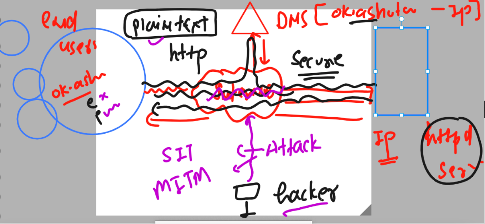

### Introduce cryptography model -- and symteric key concept

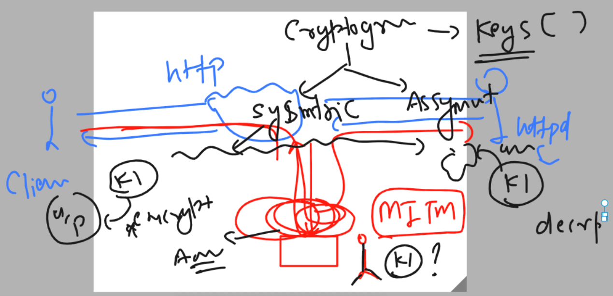

### Introducing assymetric key model 

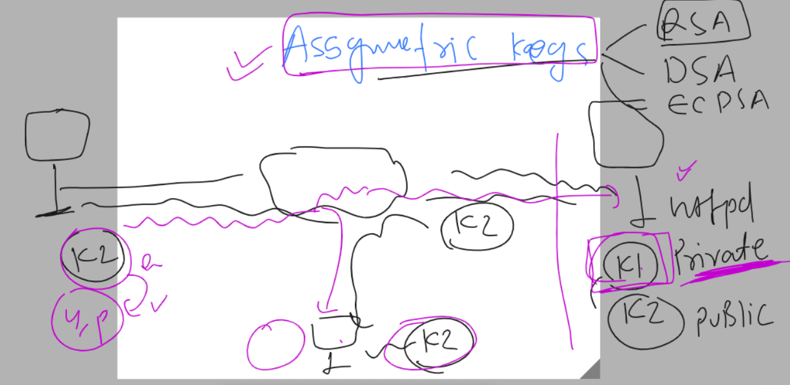

### private & public key model is only one way security 

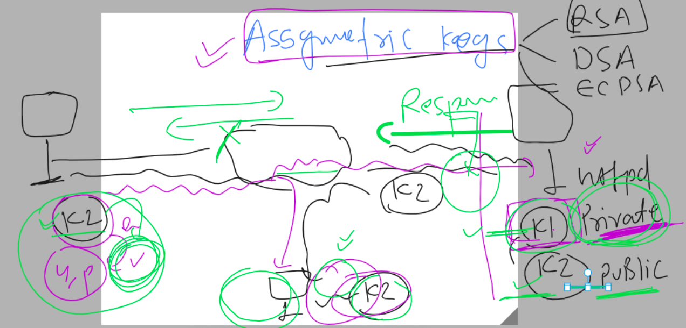

### Hybrid model compromised then SSL / TLS make in picture 

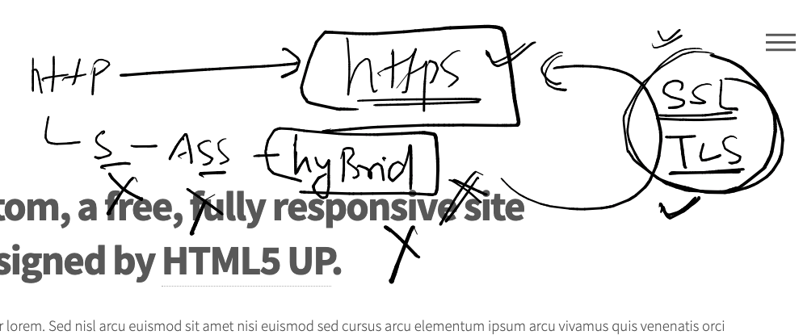

### using it here 

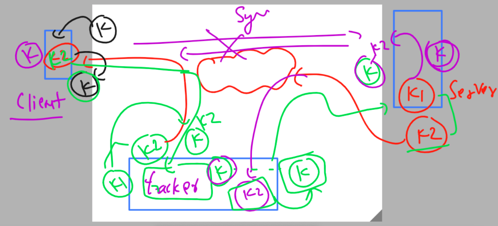

## Understanding SSL / tls 

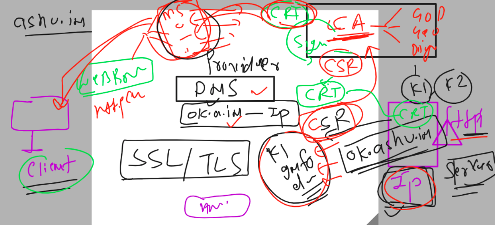

### process of SSL / TLS 

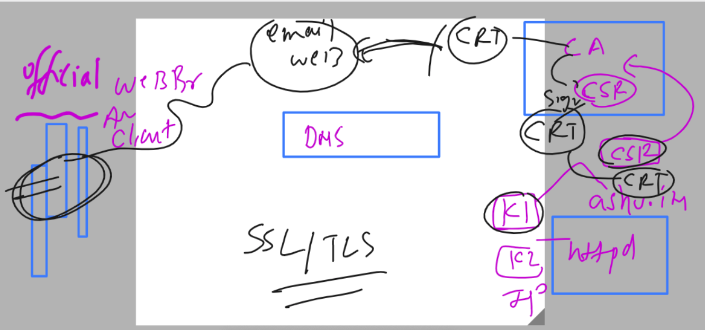

### self sign CA and key 

```
207  openssl  genrsa  2048  >private_key.pem 
  208  ls
  209  openssl req -key private_key.pem  -new -out ashu.csr 
  210  ls
  211  openssl x509 -signkey private_key.pem  -in ashu.csr  -out ashu.crt -req -days 365 
```

### process

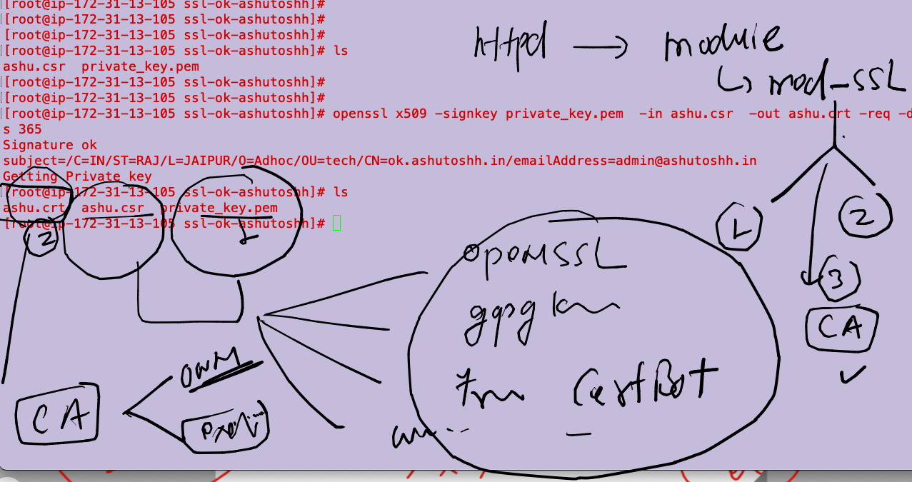

### just to implement SSL 

```
[root@ip-172-31-13-105 ~]# yum install mod_ssl 
Failed to set locale, defaulting to C
Loaded plugins: extras_suggestions, langpacks, priorities, update-motd
Package 1:mod_ssl-2.4.57-1.amzn2.x86_64 already installed and latest version
Nothing to do
[root@ip-172-31-13-105 ~]# httpd -M  | grep -i ssl 
 ssl_module (shared)
[root@ip-172-31-13-105 ~]# 
```

### checking ssl.conf file 

```
[root@ip-172-31-13-105 ~]# cd  /etc/httpd/
[root@ip-172-31-13-105 httpd]# ls
conf  conf.d  conf.modules.d  logs  modules  run  ssl-ok-ashutoshh  state
[root@ip-172-31-13-105 httpd]# cd  conf.d/
[root@ip-172-31-13-105 conf.d]# ls
README  autoindex.conf  me.conf  me1.conf  ssl.conf  userdir.conf  welcome.conf
[root@ip-172-31-13-105 conf.d]# 
```


### update servername and documentroot in ssl.conf --

```

<VirtualHost _default_:443>

# General setup for the virtual host, inherited from global configuration
DocumentRoot "/var/www/html"
ServerName ok.ashutoshh.in:443


```

### restart httpd 

```
 systemctl restart httpd
```

### apache httpd installation using source code 

## steps 

### checking os version 

```
[root@ip-172-31-17-205 ~]# cat  /etc/os-release 
NAME="Red Hat Enterprise Linux"
VERSION="9.2 (Plow)"
ID="rhel"

```


### Installing support of compiler and development tools for apache httpd sources 

```
[root@ip-172-31-17-205 ~]# yum install gcc pcre*  apr*  openssl-devel 
Updating Subscription Management repositories.
Unable to read consumer identity

This system is not registered with an entitlement server. You can use subscription-manager to register.


```

### Redhat package Development tools installation 

```
[root@ip-172-31-17-205 ~]# yum  groupinstall  "development tools"
Updating Subscription Management repositories.
Unable to read consumer identity

This system is not registered with an entitlement server. You can use subscription-manager to register.

Last metadata expiration check: 0:00:57 ago on Fri 09 Jun 2023 11:04:33 AM UTC.
Dependencies resolved.
======================================================================================================================
 Package                               Arch    Version                              Repository                   Size
======================================================================================================================
Installing group/module packages:
 asciidoc                              noarch  9.1.0-3.el9                          rhel-9-appstream-rhui-rpms  265 k
 autoconf                              noarch  2.69
```

### Download source of apache httpd 

```
[root@ip-172-31-17-205 ~]# wget  https://dlcdn.apache.org/httpd/httpd-2.4.57.tar.gz
--2023-06-09 11:08:15--  https://dlcdn.apache.org/httpd/httpd-2.4.57.tar.gz
Resolving dlcdn.apache.org (dlcdn.apache.org)... 151.101.2.132, 2a04:4e42::644
Connecting to dlcdn.apache.org (dlcdn.apache.org)|151.101.2.132|:443... connected.
HTTP request sent, awaiting response... 200 OK
Length: 9773385 (9.3M) [application/x-gzip]
Saving to: ‘httpd-2.4.57.tar.gz’

httpd-2.4.57.tar.gz           100%[===============================================>]   9.32M  --.-KB/s    in 0.1s    

2023-06-09 11:08:15 (93.1 MB/s) - ‘httpd-2.4.57.tar.gz’ saved [9773385/9773385]

[root@ip-172-31-17-205 ~]# ls
httpd-2.4.57.tar.gz
[root@ip-172-31-17-205 ~]# 
```

### extract it

```
[root@ip-172-31-17-205 ~]# ls
httpd-2.4.57.tar.gz
[root@ip-172-31-17-205 ~]# tar xvzf httpd-2.4.57.tar.gz 
httpd-2.4.57/
httpd-2.4.57/acinclude.m4
httpd-2.4.57/README.cmake
httpd-2.4.57/INSTALL
httpd-2.4.57/CMakeLists.txt
```

### checking directory 

```
[root@ip-172-31-17-205 ~]# ls
httpd-2.4.57  httpd-2.4.57.tar.gz
[root@ip-172-31-17-205 ~]# 
[root@ip-172-31-17-205 ~]# 
[root@ip-172-31-17-205 ~]# cd   httpd-2.4.57
[root@ip-172-31-17-205 httpd-2.4.57]# ls
ABOUT_APACHE     BuildAll.dsp     configure     httpd.spec      libhttpd.mak   os                srclib
acinclude.m4     BuildBin.dsp     configure.in  include         LICENSE        README            support
Apache-apr2.dsw  buildconf        docs          INSTALL         Makefile.in    README.CHANGES    test
Apache.dsw       CHANGES          emacs-style   InstallBin.dsp  Makefile.win   README.cmake      VERSIONING
apache_probes.d  changes-entries  httpd.dep     LAYOUT          modules        README.platforms
ap.d             CMakeLists.txt   httpd.dsp     libhttpd.dep    NOTICE         ROADMAP
build            config.layout    httpd.mak     libhttpd.dsp    NWGNUmakefile  server
[root@ip-172-31-17-205 httpd-2.4.57]# 
```

### setting up installation target directory 

```
[root@ip-172-31-17-205 httpd-2.4.57]# ls
ABOUT_APACHE     BuildAll.dsp     configure     httpd.spec      libhttpd.mak   os                srclib
acinclude.m4     BuildBin.dsp     configure.in  include         LICENSE        README            support
Apache-apr2.dsw  buildconf        docs          INSTALL         Makefile.in    README.CHANGES    test
Apache.dsw       CHANGES          emacs-style   InstallBin.dsp  Makefile.win   README.cmake      VERSIONING
apache_probes.d  changes-entries  httpd.dep     LAYOUT          modules        README.platforms
ap.d             CMakeLists.txt   httpd.dsp     libhttpd.dep    NOTICE         ROADMAP
build            config.layout    httpd.mak     libhttpd.dsp    NWGNUmakefile  server
[root@ip-172-31-17-205 httpd-2.4.57]# 
[root@ip-172-31-17-205 httpd-2.4.57]# 
[root@ip-172-31-17-205 httpd-2.4.57]# ./configure  --prefix=/etc/myhttpd
checking for chosen layout... Apache
checking for working mkdir -p... yes
checking for grep that handles long lines and -e... /bin/grep
checking for egrep... /bin/grep -E
checking build system type... x86_64-pc-linux-gnu

```

### compile source code 

```
[root@ip-172-31-17-205 httpd-2.4.57]# make 
Making all in srclib
make[1]: Entering directory '/root/httpd-2.4.57/srclib'
make[1]: Leaving directory '/root/httpd-2.4.57/srclib'
Making all in os
make[1]: Entering directory '/root/httpd-2.4.57/os'
Making all in unix

```

### install it 

```
[root@ip-172-31-17-205 httpd-2.4.57]# make install 
Making install in srclib
make[1]: Entering directory '/root/httpd-2.4.57/srclib'
make[2]: Entering directory '/root/httpd-2.4.57/srclib'
make[2]: Leaving directory '/root/httpd-2.4.57/srclib'
make[1]: Leaving directory '/root/httpd-2.4.57/srclib'
Making install in os
make[1]: Entering directory '/root/httpd-2.4.57/os'
Making install in unix
make[2]: Entering directory '/root/httpd-2.4.57/os/un
```

### we can check and verify 

```
[root@ip-172-31-17-205 httpd-2.4.57]# cd  /etc/myhttpd/
[root@ip-172-31-17-205 myhttpd]# ls
bin  build  cgi-bin  conf  error  htdocs  icons  include  logs  man  manual  modules
[root@ip-172-31-17-205 myhttpd]# cd conf/
[root@ip-172-31-17-205 conf]# ls
extra  httpd.conf  magic  mime.types  original
```

### staring the service 

```

[root@ip-172-31-17-205 myhttpd]# ls
bin  build  cgi-bin  conf  error  htdocs  icons  include  logs  man  manual  modules
[root@ip-172-31-17-205 myhttpd]# pwd
/etc/myhttpd
[root@ip-172-31-17-205 myhttpd]# ls
bin  build  cgi-bin  conf  error  htdocs  icons  include  logs  man  manual  modules
[root@ip-172-31-17-205 myhttpd]# cd bin/
[root@ip-172-31-17-205 bin]# ls
ab         apxs      dbmmanage  envvars-std  htcacheclean  htdigest  httpd      logresolve
apachectl  checkgid  envvars    fcgistarter  htdbm         htpasswd  httxt2dbm  rotatelogs
[root@ip-172-31-17-205 bin]# 
[root@ip-172-31-17-205 bin]# ./apachectl -k start 
[root@ip-172-31-17-205 bin]# yum install net-tools -y &>/dev/null 
[root@ip-172-31-17-205 bin]# 
[root@ip-172-31-17-205 bin]# 
[root@ip-172-31-17-205 bin]# netstat -nlpt
Active Internet connections (only servers)
Proto Recv-Q Send-Q Local Address           Foreign Address         State       PID/Program name    
tcp        0      0 0.0.0.0:22              0.0.0.0:*               LISTEN      34246/sshd: /usr/sb 
tcp6       0      0 :::80                   :::*                    LISTEN      62020/httpd         
tcp6       0      0 :::22                   :::*                    LISTEN      34246/sshd: /usr/sb 
[root@ip-172-31-17-205 bin]# ./apachectl -k stop 
[root@ip-172-31-17-205 bin]# ./httpd -D FOREGROUND |  BACKGROUND 

```


