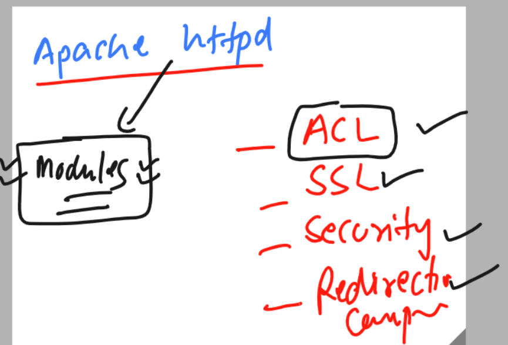

## Getting started

### Revision 


### target for the day 


### check as per previous configuration 

```
[ec2-user@ip-172-31-13-105 ~]$ whoami
ec2-user
[ec2-user@ip-172-31-13-105 ~]$ sudo -i
[root@ip-172-31-13-105 ~]# rpm -q httpd
httpd-2.4.57-1.amzn2.x86_64
[root@ip-172-31-13-105 ~]# systemctl status httpd
● httpd.service - The Apache HTTP Server
   Loaded: loaded (/usr/lib/systemd/system/httpd.service; enabled; vendor preset: disabled)
   Active: active (running) since Fri 2023-06-09 03:23:56 UTC; 1h 11min ago
     Docs: man:httpd.service(8)
 Main PID: 2954 (httpd)
   Status: "Total requests: 14; Idle/Busy workers 100/0;Requests/sec: 0.00325; Bytes served/sec:   3 B/sec"
   CGroup: /system.slice/httpd.service

```

## ACL is httpd 


### features like ACL can be implemented in httpd using Module concept 



### info about modules 


### checking modules configuration files 

```
[root@ip-172-31-13-105 conf.d]# cd  /etc/httpd/
[root@ip-172-31-13-105 httpd]# ls
conf  conf.d  conf.modules.d  logs  modules  run  state
[root@ip-172-31-13-105 httpd]# 
[root@ip-172-31-13-105 httpd]# 
[root@ip-172-31-13-105 httpd]# cd  conf.
conf.d/         conf.modules.d/ 
[root@ip-172-31-13-105 httpd]# cd  conf.modules.d/
[root@ip-172-31-13-105 conf.modules.d]# ls
00-base.conf  00-lua.conf  00-optional.conf  00-systemd.conf  10-h2.conf        README
00-dav.conf   00-mpm.conf  00-proxy.conf     01-cgi.conf      10-proxy_h2.conf
[root@ip-172-31-13-105 conf.modules.d]# 
```

### by default all the modules are stored in given location 

```
[root@ip-172-31-13-105 conf.modules.d]# cd  /etc/httpd/
[root@ip-172-31-13-105 httpd]# ls
conf  conf.d  conf.modules.d  logs  modules  run  state
[root@ip-172-31-13-105 httpd]# cd modules/
[root@ip-172-31-13-105 modules]# ls
mod_access_compat.so    mod_cgid.so                 mod_log_config.so      mod_ratelimit.so
mod_actions.so          mod_charset_lite.so         mod_log_debug.so       mod_reflector.so
mod_alias.so            mod_data.so                 mod_log_forensic.so    mod_remoteip.so
mod_allowmethods.so     mod_dav.so                  mod_logio.so           mod_reqtimeout.so
mod_asis.so             mod_dav_fs.so               mod_lua.so             mod_request.so
mod_auth_basic.so       mod_dav_lock.so             mod_macro.so           mod_rewrite.so
```

### you can also check list of loaded modules 

```
[root@ip-172-31-13-105 modules]# httpd -M  
Loaded Modules:
 core_module (static)
 so_module (static)
 http_module (static)
 access_compat_module (shared)
```


