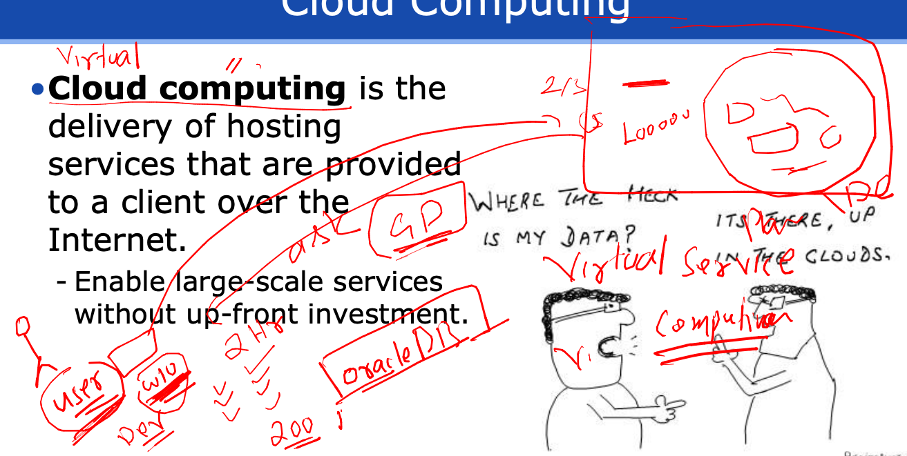
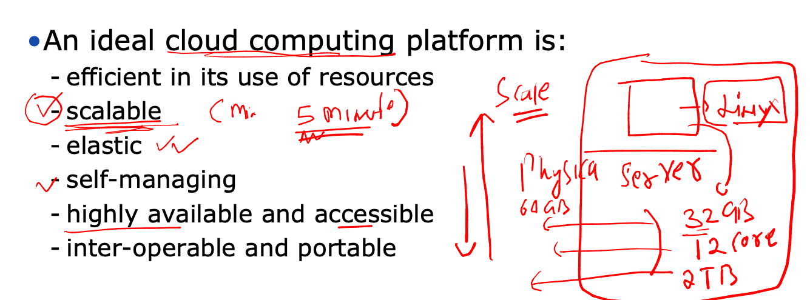

# fss-apache-training

### Introduction to cloud computing 


### more info 



## cloud features 



### public vs private cloud 


## CLoud Delivery Model 

### IAAS 


### PAAS 


### to get resource from cloud we can use their web port 


### Region in amazon cloud 


### introduction to service in cloud under region 


### Introduction creation of linux machine in cloud env


### lets connect using ssh to the Instance 

```
fire@ashutoshhs-MacBook-Air ~ % cd  Desktop 
fire@ashutoshhs-MacBook-Air Desktop % ssh -i ashu-private-key.pem ec2-user@3.12.161.158
The authenticity of host '3.12.161.158 (3.12.161.158)' can't be established.
ECDSA key fingerprint is SHA256:cCr8k6q64y4NbH9wdkuJKpC9ltsDCbKAu6k5DptpyY8.
Are you sure you want to continue connecting (yes/no/[fingerprint])? yes
Warning: Permanently added '3.12.161.158' (ECDSA) to the list of known hosts.
@@@@@@@@@@@@@@@@@@@@@@@@@@@@@@@@@@@@@@@@@@@@@@@@@@@@@@@@@@@
@         WARNING: UNPROTECTED PRIVATE KEY FILE!          @
@@@@@@@@@@@@@@@@@@@@@@@@@@@@@@@@@@@@@@@@@@@@@@@@@@@@@@@@@@@
Permissions 0644 for 'ashu-private-key.pem' are too open.
It is required that your private key files are NOT accessible by others.
This private key will be ignored.
Load key "ashu-private-key.pem": bad permissions
ec2-user@3.12.161.158: Permission denied (publickey,gssapi-keyex,gssapi-with-mic).
fire@ashutoshhs-MacBook-Air Desktop % chmod 400 ashu-private-key.pem 
fire@ashutoshhs-MacBook-Air Desktop % 
fire@ashutoshhs-MacBook-Air Desktop % ssh -i ashu-private-key.pem ec2-user@3.12.161.158
Register this system with Red Hat Insights: insights-client --register
Create an account or view all your systems at https://red.ht/insights-dashboard
[ec2-user@ip-172-31-8-154 ~]$ 
[ec2-user@ip-172-31-8-154 ~]$ 
[ec2-user@ip-172-31-8-154 ~]$ uname -r
5.14.0-284.11.1.el9_2.x86_64
[ec2-user@ip-172-31-8-154 ~]$ cat /etc/os-release 
NAME="Red Hat Enterprise Linux"
VERSION="9.2 (Plow)"
ID="rhel"
ID_LIKE="fedora"
VERSION_ID="9.2"
PLATFORM_ID="platform:el9"
PRETTY_NAME="Red Hat Enterprise Linux 9.2 (Plow)"
ANSI_COLOR="0;31"

```


