# fss-apache-training

### Revision 

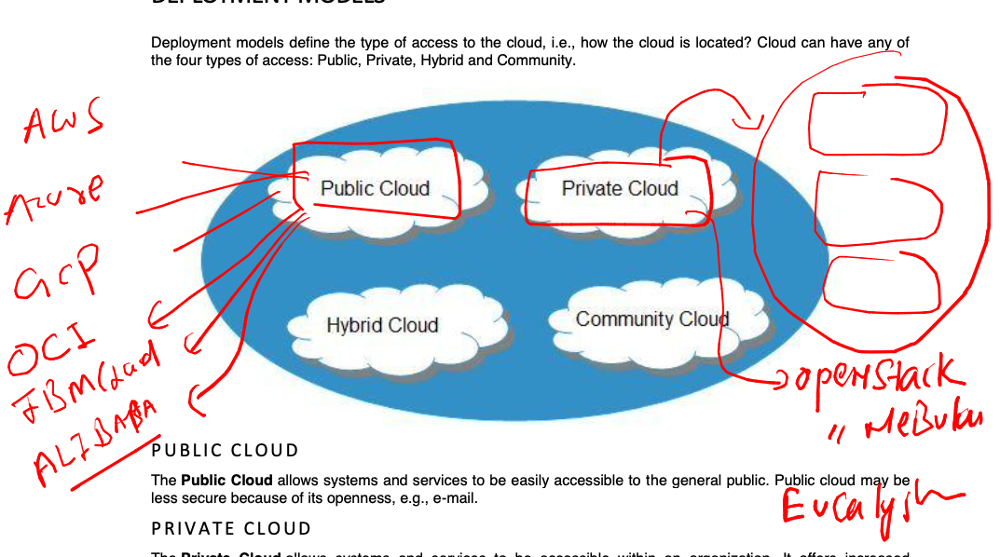

### Cloud is using av zone under same Region to make resource Highly available 

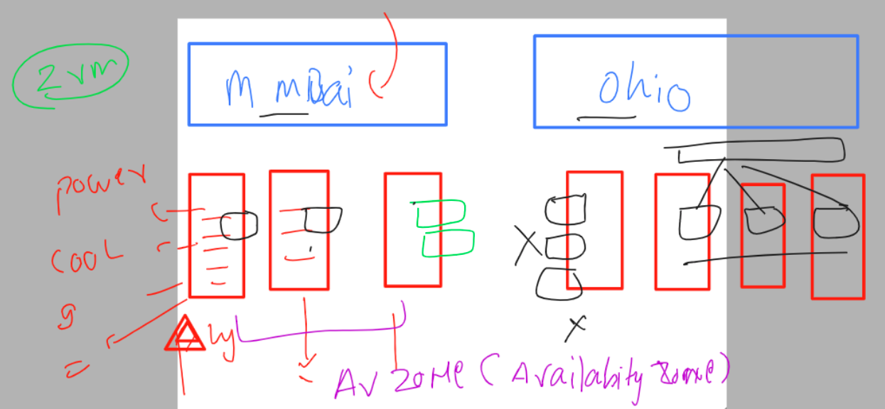

## storage in cloud 

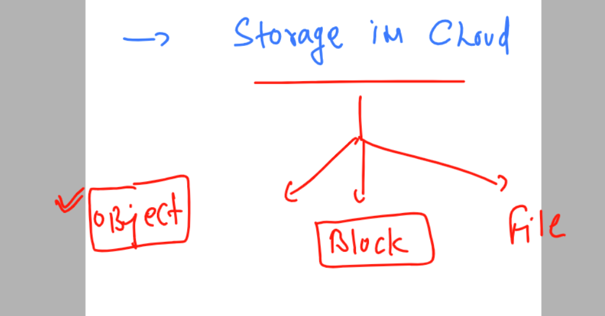

### Object storage 

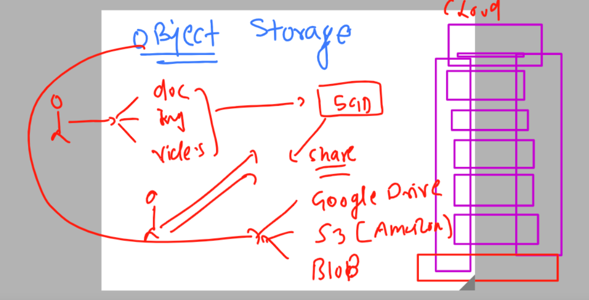

### amazon s3 

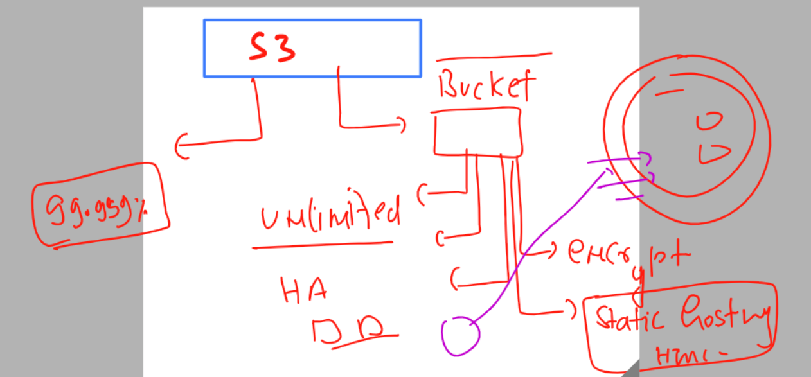

### problem with object and introduction to block storage

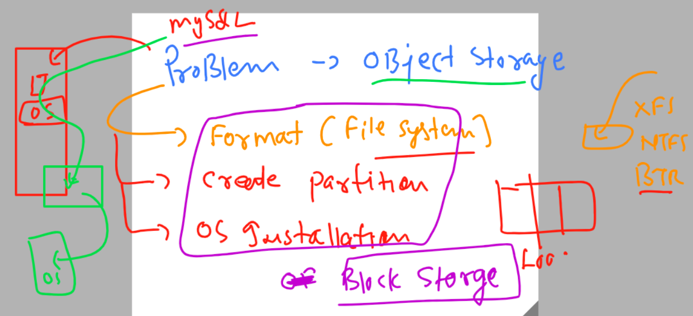

### welcome to amazon s3 one of the global service in amazon 

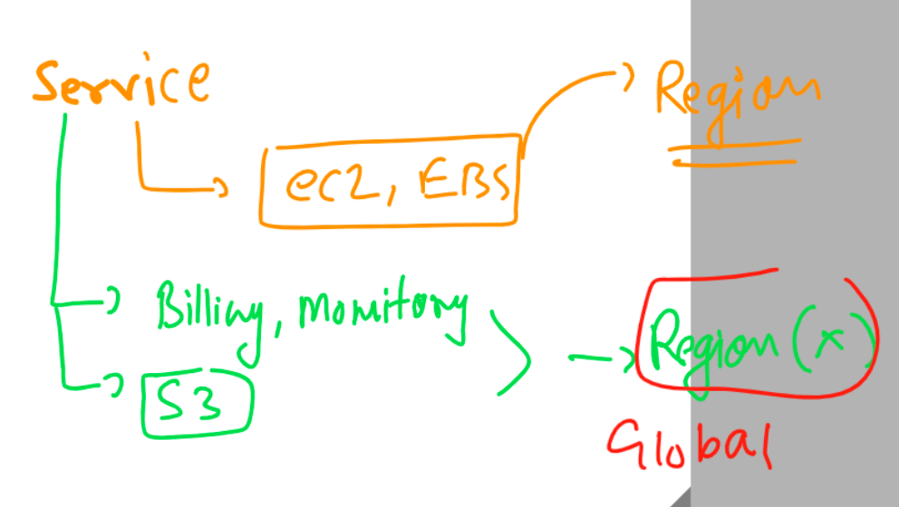

### Revision 

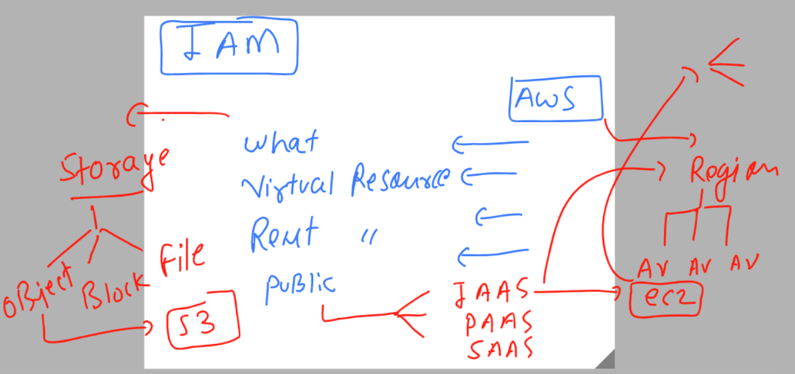

### Introduction IAM in cloud 

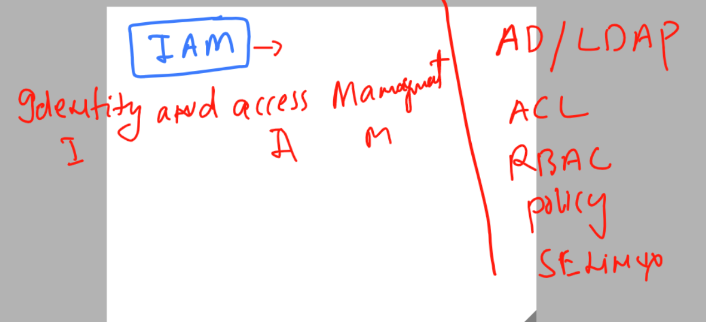

### IAM in details 

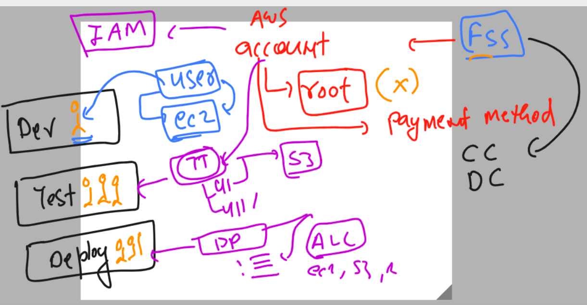

### ways to access amazon cloud platform 

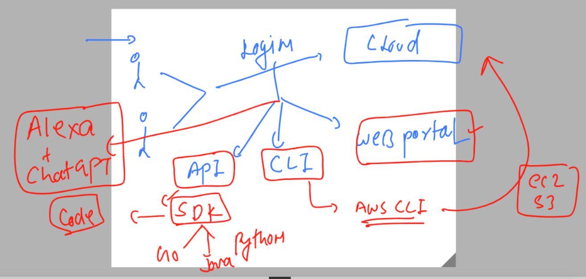

### Installing aws cli on windows 

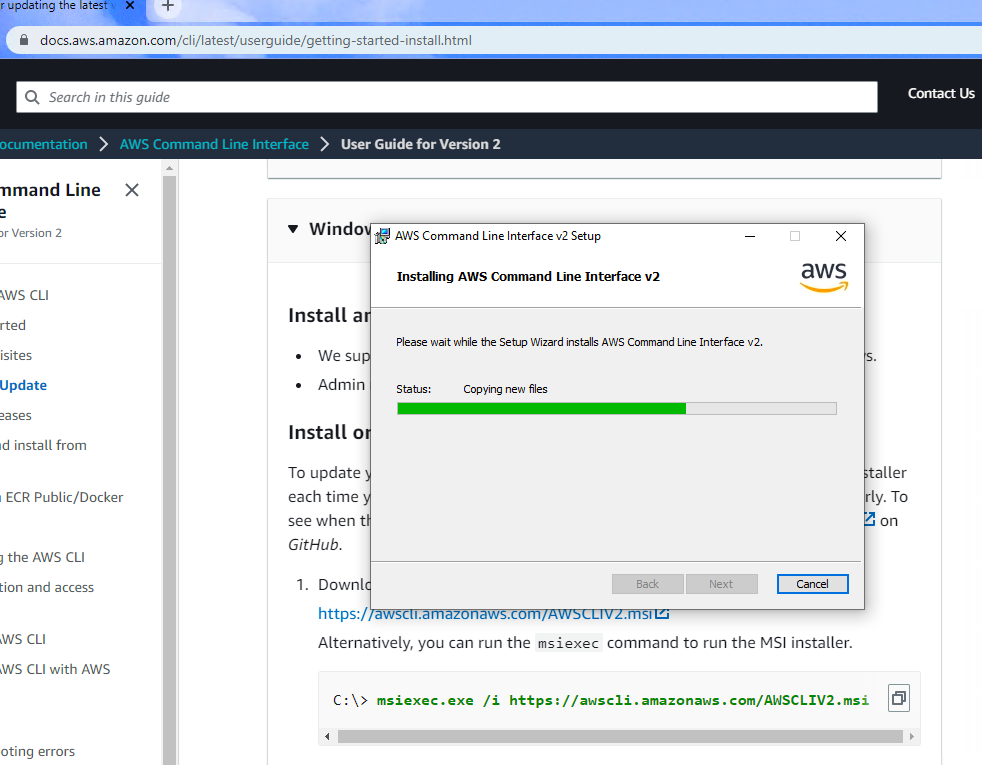

### login to linux machine and checking aws cli 

```
PS C:\Users\hp> ssh  ashu@65.2.19.1
The authenticity of host '65.2.19.1 (65.2.19.1)' can't be established.
ECDSA key fingerprint is SHA256:45jjLs5VryXM8GxepYwa/+lMcGQR85QGnfSFV8KRShM.
Are you sure you want to continue connecting (yes/no/[fingerprint])? yes
Warning: Permanently added '65.2.19.1' (ECDSA) to the list of known hosts.
ashu@65.2.19.1's password:

       __|  __|_  )
       _|  (     /   Amazon Linux 2 AMI
      ___|\___|___|

https://aws.amazon.com/amazon-linux-2/
[ashu@ip-172-31-3-89 ~]$
[ashu@ip-172-31-3-89 ~]$ whoami
ashu
[ashu@ip-172-31-3-89 ~]$ aws -v
Note: AWS CLI version 2, the latest major version of the AWS CLI, is now stable and recommended for general use. For more information, see the AWS CLI version 2 installation instructions at: https://docs.aws.amazon.com/cli/latest/userguide/install-cliv2.html

usage: aws [options] <command> <subcommand> [<subcommand> ...] [parameters]
To see help text, you can run:

  aws help
  aws <command> help
  aws <command> <subcommand> help
aws: error: too few arguments
[ashu@ip-172-31-3-89 ~]$ aws --version
aws-cli/1.18.147 Python/2.7.18 Linux/5.10.179-166.674.amzn2.x86_64 botocore/1.18.6
[ashu@ip-172-31-3-89 ~]$
```

### aws access things

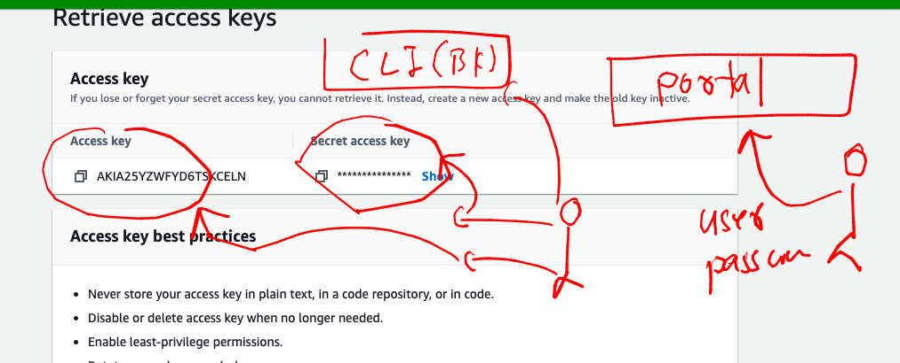

### How to configure aws cli in any OS -- LInux | windows | mac 

```
[ashu@ip-172-31-3-89 ~]$ aws configure 
AWS Access Key ID [None]: TSKC
AWS Secret Access Key [None]: xpq0S
Default region name [None]: us-east-2
Default output format [None]: 
```


