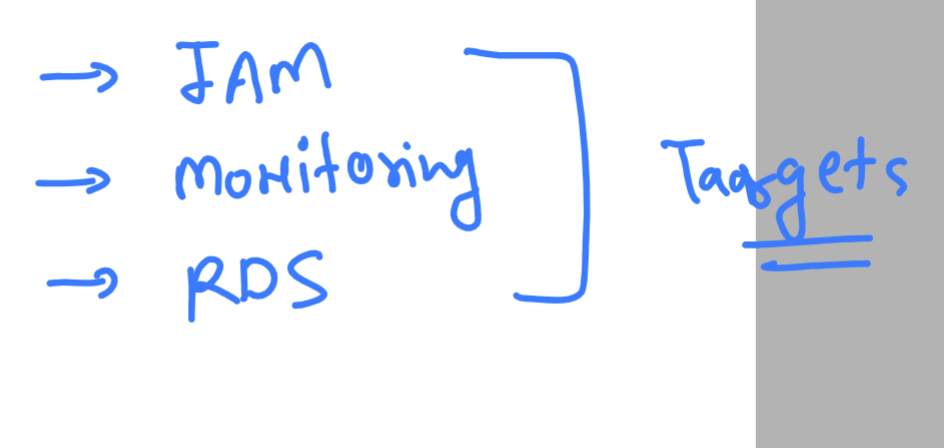
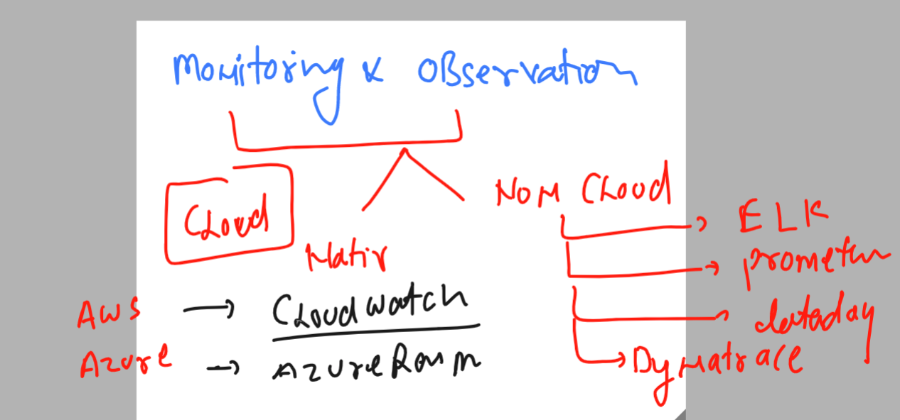
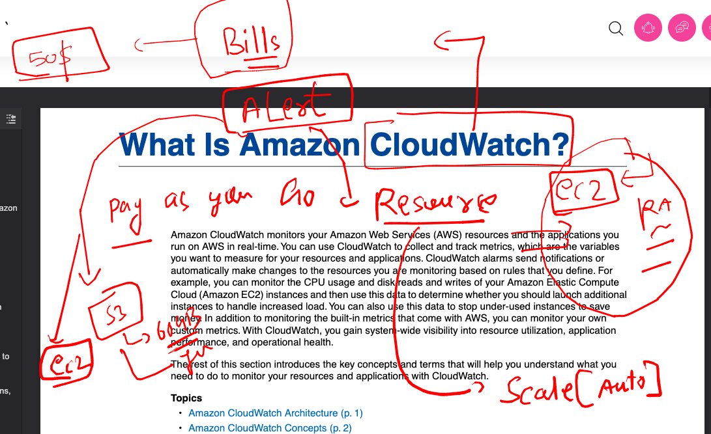
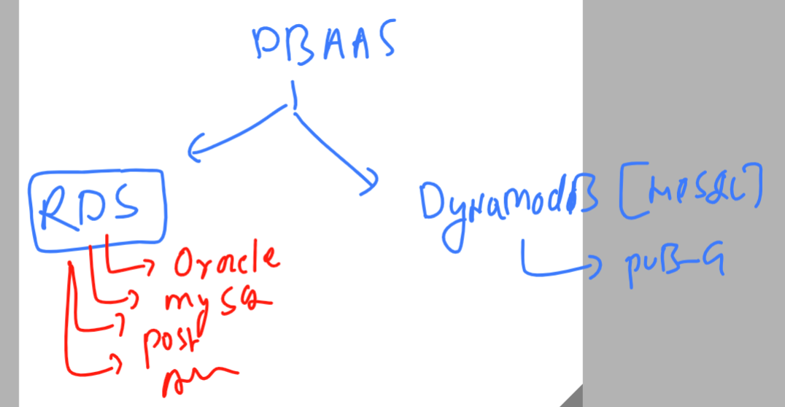

# fss-apache-training
## Target 



### Understanding things in IAM env 


### Monitoring and observation in aws cloud - Using Cloud watch 



## Introduction to Cloudwatch in aws cloud 



### More info about cloudwatch architecture 


### SNS with cloudwatch 


### creating SNS topic and subscribing it 


### DBAAS 


### Dbaas 1 for cloud model 



### MYSQL server and client understanding 


### connecting to mysql client machine 

```
fire@ashutoshhs-MacBook-Air ~ % ssh  test@18.118.104.249
test@18.118.104.249's password: 

       __|  __|_  )
       _|  (     /   Amazon Linux 2 AMI
      ___|\___|___|

```

### from here lets connect mysql server (RDS)

```
[test@ip-172-31-29-89 ~]$ mysql -u admin -h ashu-mysql-database.cs0yvdoffhxb.us-east-2.rds.amazonaws.com -p
Enter password: 
Welcome to the MariaDB monitor.  Commands end with ; or \g.
Your MySQL connection id is 24
Server version: 5.7.42-log Source distribution

Copyright (c) 2000, 2018, Oracle, MariaDB Corporation Ab and others.

Type 'help;' or '\h' for help. Type '\c' to clear the current input statement.

MySQL [(none)]> show databases;
+--------------------+
| Database           |
+--------------------+
| information_schema |
| innodb             |
| mysql              |
| performance_schema |
| sys                |
+--------------------+
5 rows in set (0.00 sec)

MySQL [(none)]> quit;

```

