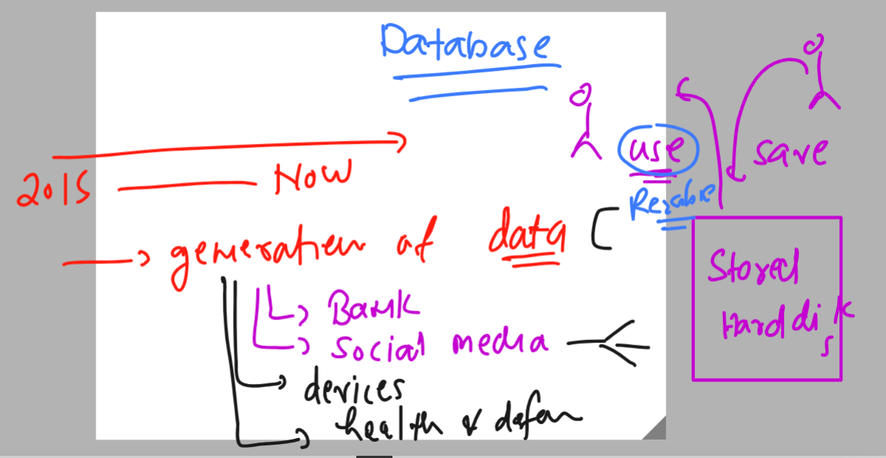
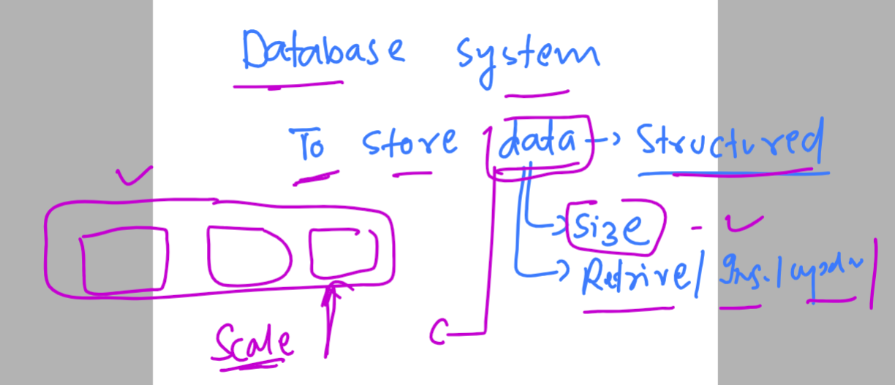
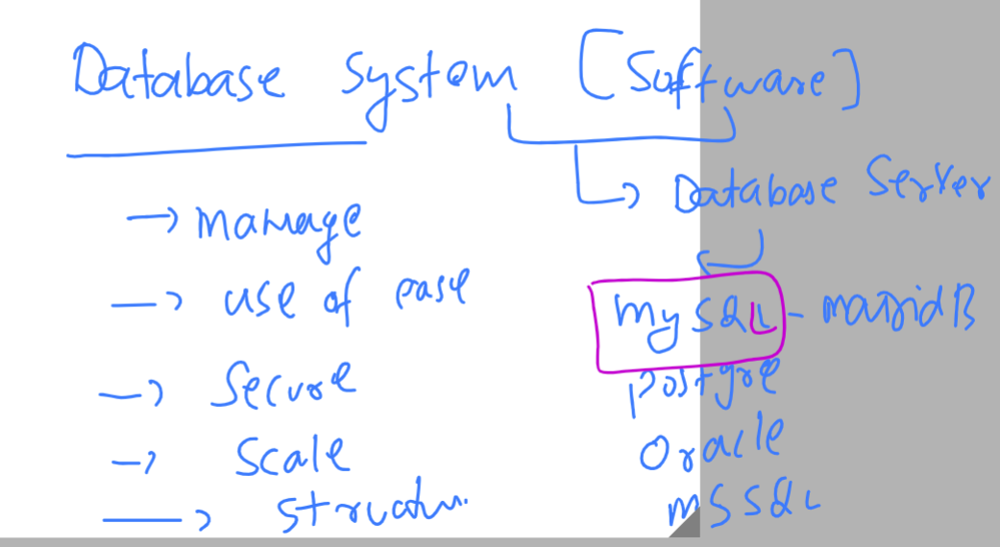
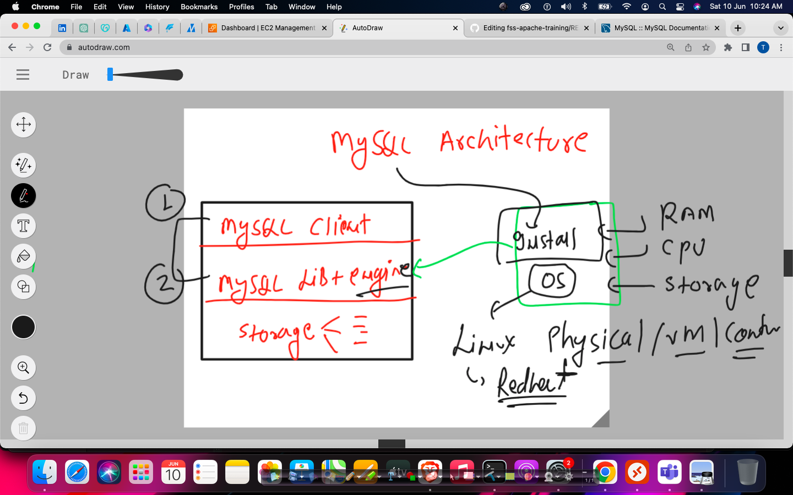

# MYSQL administration 

### Info about data and its storage



### problem with XLS or any relevent software to manage huge amount of data


### introduction to database system 



### getting started with database server systems 



## MYSQL database server 

### as single machine architecture 



### to install and create mysql database - i am login to linux machine using ssh

```
fire@ashutoshhs-MacBook-Air ~ % cd  Downloads 
fire@ashutoshhs-MacBook-Air Downloads % 
fire@ashutoshhs-MacBook-Air Downloads % ssh -i "ashu-database-cred-key.pem" ec2-user@ec2-18-191-192-32.us-east-2.compute.amazonaws.com
The authenticity of host 'ec2-18-191-192-32.us-east-2.compute.amazonaws.com (18.191.192.32)' can't be established.
ECDSA key fingerprint is SHA256:pbb0lhVZdLbwrM7QPkokFDjRnAD+QYJ+Q1gkOWeesy0.
Are you sure you want to continue connecting (yes/no/[fingerprint])? yes
Warning: Permanently added 'ec2-18-191-192-32.us-east-2.compute.amazonaws.com,18.191.192.32' (ECDSA) to the list of known hosts.
@@@@@@@@@@@@@@@@@@@@@@@@@@@@@@@@@@@@@@@@@@@@@@@@@@@@@@@@@@@
@         WARNING: UNPROTECTED PRIVATE KEY FILE!          @
@@@@@@@@@@@@@@@@@@@@@@@@@@@@@@@@@@@@@@@@@@@@@@@@@@@@@@@@@@@
Permissions 0644 for 'ashu-database-cred-key.pem' are too open.
It is required that your private key files are NOT accessible by others.
This private key will be ignored.
Load key "ashu-database-cred-key.pem": bad permissions
ec2-user@ec2-18-191-192-32.us-east-2.compute.amazonaws.com: Permission denied (publickey,gssapi-keyex,gssapi-with-mic).
fire@ashutoshhs-MacBook-Air Downloads % chmod 400 ashu-database-cred-key.pem
fire@ashutoshhs-MacBook-Air Downloads % ssh -i "ashu-database-cred-key.pem" ec2-user@ec2-18-191-192-32.us-east-2.compute.amazonaws.com

       __|  __|_  )
       _|  (     /   Amazon Linux 2 AMI
      ___|\___|___|

https://aws.amazon.com/amazon-linux-2/
7 package(s) needed for security, out of 11 available
Run "sudo yum update" to apply all updates.
-bash: warning: setlocale: LC_CTYPE: cannot change locale (UTF-8): No such file or directory
[ec2-user@ip-172-31-4-196 ~]$ 

```

### verify few info of OS 

```
[ec2-user@ip-172-31-4-196 ~]$ whoami
ec2-user
[ec2-user@ip-172-31-4-196 ~]$ 
[ec2-user@ip-172-31-4-196 ~]$ uname
Linux
[ec2-user@ip-172-31-4-196 ~]$ 
[ec2-user@ip-172-31-4-196 ~]$ 
[ec2-user@ip-172-31-4-196 ~]$ uname -r
5.10.179-168.710.amzn2.x86_64
[ec2-user@ip-172-31-4-196 ~]$ 
[ec2-user@ip-172-31-4-196 ~]$ cat  /etc/os-release 
NAME="Amazon Linux"
VERSION="2"
ID="amzn"
ID_LIKE="centos rhel fedora"
VERSION_ID="2"
PRETTY_NAME="Amazon Linux 2"
ANSI_COLOR="0;33"
CPE_NAME="cpe:2.3:o:amazon:amazon_linux:2"
```

## Steps to install mysql-server 

### checking any software related to mysql 

```
[ec2-user@ip-172-31-4-196 ~]$ rpm -qa  mysql* 
[ec2-user@ip-172-31-4-196 ~]$ 

```

###  Steps to update libraries 

```
[ec2-user@ip-172-31-4-196 ~]$ sudo  yum  update 
Failed to set locale, defaulting to C
Loaded plugins: extras_suggestions, langpacks, priorities, update-motd
amzn2-core                                                                                     | 3.7 kB  00:00:00     
Resolving Dependencies
--> Running transaction check
---> Package curl.x86_64 0:7.88.1-1.amzn2.0.1 will be updated
---> Package curl.x86_64 0:8.0.1-1.amzn2.0.1 will be an update
---> Package hibagent.noarch 0:1.1.0-5.amzn2 will be updated

```

### Install mysql-server or new version is named as mariadb-server 

```
[ec2-user@ip-172-31-4-196 ~]$ sudo yum  install mysql-server 
Failed to set locale, defaulting to C
Loaded plugins: extras_suggestions, langpacks, priorities, update-motd
amzn2-core                                                                                     | 3.7 kB  00:00:00     
No package mysql-server available.
Error: Nothing to do
[ec2-user@ip-172-31-4-196 ~]$ sudo yum  install mairadb-server 
Failed to set locale, defaulting to C
Loaded plugins: extras_suggestions, langpacks, priorities, update-motd
No package mairadb-server available.
Error: Nothing to do
[ec2-user@ip-172-31-4-196 ~]$ sudo yum  install mariadb-server
Failed to set locale, defaulting to C
Loaded plugins: extras_suggestions, langpacks, priorities, update-motd
Resolving Dependencies
--> Running transaction check
---> Package mariadb-server.x86_64 1:5.5.68-1.amzn2.0.1 will be installed

```

### verify installation 

```
[ec2-user@ip-172-31-4-196 ~]$ rpm  -qa mariadb* 
mariadb-libs-5.5.68-1.amzn2.0.1.x86_64
mariadb-5.5.68-1.amzn2.0.1.x86_64
mariadb-server-5.5.68-1.amzn2.0.1.x86_64
[ec2-user@ip-172-31-4-196 ~]$ 


```

### starting service 

```
[ec2-user@ip-172-31-4-196 ~]$ sudo systemctl start mariadb
[ec2-user@ip-172-31-4-196 ~]$ sudo systemctl status mariadb
● mariadb.service - MariaDB database server
   Loaded: loaded (/usr/lib/systemd/system/mariadb.service; disabled; vendor preset: disabled)
   Active: active (running) since Sat 2023-06-10 06:08:19 UTC; 6s ago
  Process: 4156 ExecStartPost=/usr/libexec/mariadb-wait-ready $MAINPID (code=exited, status=0/SUCCESS)
  Process: 4073 ExecStartPre=/usr/libexec/mariadb-prepare-db-dir %
  
  
```

### making service auto start if you machine is going to reboot or shutdwon 

```
[ec2-user@ip-172-31-4-196 ~]$ sudo systemctl enable  mariadb
```


