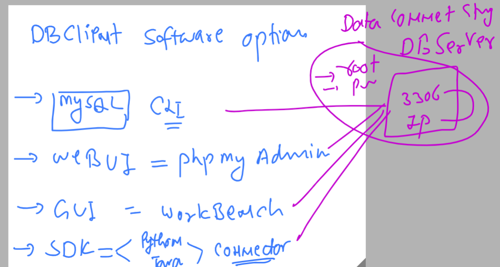
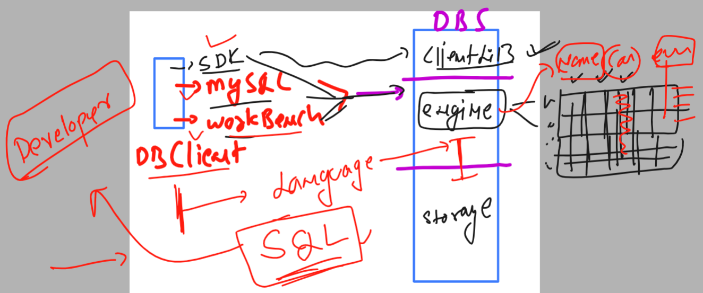
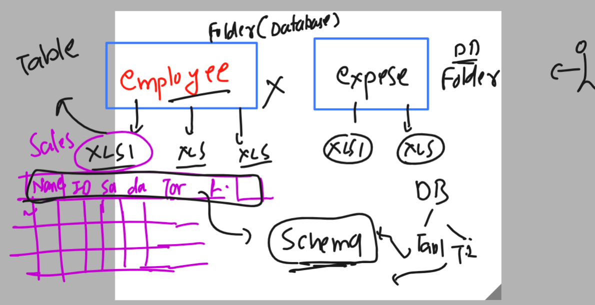
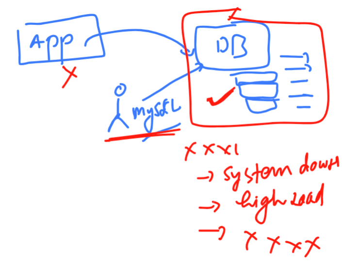
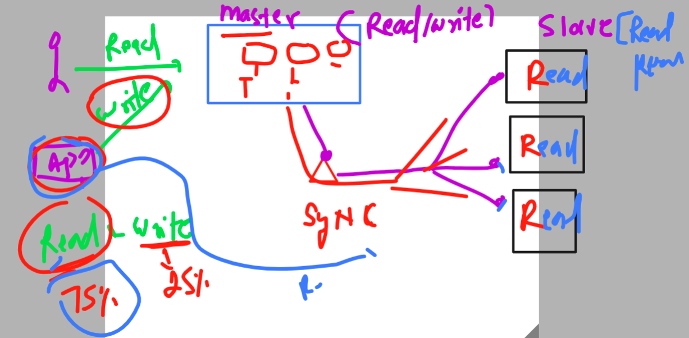

# MYSQL administration 

### Info about data and its storage


### problem with XLS or any relevent software to manage huge amount of data


### introduction to database system 


### getting started with database server systems 


## MYSQL database server 

### as single machine architecture 


### to install and create mysql database - i am login to linux machine using ssh

```
fire@ashutoshhs-MacBook-Air ~ % cd  Downloads 
fire@ashutoshhs-MacBook-Air Downloads % 
fire@ashutoshhs-MacBook-Air Downloads % ssh -i "ashu-database-cred-key.pem" ec2-user@ec2-18-191-192-32.us-east-2.compute.amazonaws.com
The authenticity of host 'ec2-18-191-192-32.us-east-2.compute.amazonaws.com (18.191.192.32)' can't be established.
ECDSA key fingerprint is SHA256:pbb0lhVZdLbwrM7QPkokFDjRnAD+QYJ+Q1gkOWeesy0.
Are you sure you want to continue connecting (yes/no/[fingerprint])? yes
Warning: Permanently added 'ec2-18-191-192-32.us-east-2.compute.amazonaws.com,18.191.192.32' (ECDSA) to the list of known hosts.
@@@@@@@@@@@@@@@@@@@@@@@@@@@@@@@@@@@@@@@@@@@@@@@@@@@@@@@@@@@
@         WARNING: UNPROTECTED PRIVATE KEY FILE!          @
@@@@@@@@@@@@@@@@@@@@@@@@@@@@@@@@@@@@@@@@@@@@@@@@@@@@@@@@@@@
Permissions 0644 for 'ashu-database-cred-key.pem' are too open.
It is required that your private key files are NOT accessible by others.
This private key will be ignored.
Load key "ashu-database-cred-key.pem": bad permissions
ec2-user@ec2-18-191-192-32.us-east-2.compute.amazonaws.com: Permission denied (publickey,gssapi-keyex,gssapi-with-mic).
fire@ashutoshhs-MacBook-Air Downloads % chmod 400 ashu-database-cred-key.pem
fire@ashutoshhs-MacBook-Air Downloads % ssh -i "ashu-database-cred-key.pem" ec2-user@ec2-18-191-192-32.us-east-2.compute.amazonaws.com

       __|  __|_  )
       _|  (     /   Amazon Linux 2 AMI
      ___|\___|___|

https://aws.amazon.com/amazon-linux-2/
7 package(s) needed for security, out of 11 available
Run "sudo yum update" to apply all updates.
-bash: warning: setlocale: LC_CTYPE: cannot change locale (UTF-8): No such file or directory
[ec2-user@ip-172-31-4-196 ~]$ 

```

### verify few info of OS 

```
[ec2-user@ip-172-31-4-196 ~]$ whoami
ec2-user
[ec2-user@ip-172-31-4-196 ~]$ 
[ec2-user@ip-172-31-4-196 ~]$ uname
Linux
[ec2-user@ip-172-31-4-196 ~]$ 
[ec2-user@ip-172-31-4-196 ~]$ 
[ec2-user@ip-172-31-4-196 ~]$ uname -r
5.10.179-168.710.amzn2.x86_64
[ec2-user@ip-172-31-4-196 ~]$ 
[ec2-user@ip-172-31-4-196 ~]$ cat  /etc/os-release 
NAME="Amazon Linux"
VERSION="2"
ID="amzn"
ID_LIKE="centos rhel fedora"
VERSION_ID="2"
PRETTY_NAME="Amazon Linux 2"
ANSI_COLOR="0;33"
CPE_NAME="cpe:2.3:o:amazon:amazon_linux:2"
```

## Steps to install mysql-server 

### checking any software related to mysql 

```
[ec2-user@ip-172-31-4-196 ~]$ rpm -qa  mysql* 
[ec2-user@ip-172-31-4-196 ~]$ 

```

###  Steps to update libraries 

```
[ec2-user@ip-172-31-4-196 ~]$ sudo  yum  update 
Failed to set locale, defaulting to C
Loaded plugins: extras_suggestions, langpacks, priorities, update-motd
amzn2-core                                                                                     | 3.7 kB  00:00:00     
Resolving Dependencies
--> Running transaction check
---> Package curl.x86_64 0:7.88.1-1.amzn2.0.1 will be updated
---> Package curl.x86_64 0:8.0.1-1.amzn2.0.1 will be an update
---> Package hibagent.noarch 0:1.1.0-5.amzn2 will be updated

```

### Install mysql-server or new version is named as mariadb-server 

```
[ec2-user@ip-172-31-4-196 ~]$ sudo yum  install mysql-server 
Failed to set locale, defaulting to C
Loaded plugins: extras_suggestions, langpacks, priorities, update-motd
amzn2-core         no softwware is present                                                                            | 3.7 kB  00:00:00     


[ec2-user@ip-172-31-4-196 ~]$ sudo yum  install mariadb-server
Failed to set locale, defaulting to C
Loaded plugins: extras_suggestions, langpacks, priorities, update-motd
Resolving Dependencies
--> Running transaction check
---> Package mariadb-server.x86_64 1:5.5.68-1.amzn2.0.1 will be installed

```

### verify installation 

```
[ec2-user@ip-172-31-4-196 ~]$ rpm  -qa mariadb* 
mariadb-libs-5.5.68-1.amzn2.0.1.x86_64
mariadb-5.5.68-1.amzn2.0.1.x86_64
mariadb-server-5.5.68-1.amzn2.0.1.x86_64
[ec2-user@ip-172-31-4-196 ~]$ 


```

### starting service 

```
[ec2-user@ip-172-31-4-196 ~]$ sudo systemctl start mariadb
[ec2-user@ip-172-31-4-196 ~]$ sudo systemctl status mariadb
● mariadb.service - MariaDB database server
   Loaded: loaded (/usr/lib/systemd/system/mariadb.service; disabled; vendor preset: disabled)
   Active: active (running) since Sat 2023-06-10 06:08:19 UTC; 6s ago
  Process: 4156 ExecStartPost=/usr/libexec/mariadb-wait-ready $MAINPID (code=exited, status=0/SUCCESS)
  Process: 4073 ExecStartPre=/usr/libexec/mariadb-prepare-db-dir %
  
  
```

### making service auto start if you machine is going to reboot or shutdwon 

```
[ec2-user@ip-172-31-4-196 ~]$ sudo systemctl enable  mariadb
```

## Explore config and logs details of mysql / mariadb server

### below example server.cnf is the main config file to tune or set server 

```
[ec2-user@ip-172-31-4-196 ~]$ cd  /etc/my.cnf.d/
[ec2-user@ip-172-31-4-196 my.cnf.d]$ ls
client.cnf  mysql-clients.cnf  server.cnf
```

### ultimate config file and related details 

```
[ec2-user@ip-172-31-4-196 my.cnf.d]$ cat  /etc/my.cnf
[mysqld]
datadir=/var/lib/mysql
socket=/var/lib/mysql/mysql.sock
# Disabling symbolic-links is recommended to prevent assorted security risks
symbolic-links=0
# Settings user and group are ignored when systemd is used.
# If you need to run mysqld under a different user or group,
# customize your systemd unit file for mariadb according to the
# instructions in http://fedoraproject.org/wiki/Systemd

[mysqld_safe]
log-error=/var/log/mariadb/mariadb.log
pid-file=/var/run/mariadb/mariadb.pid

#
# include all files from the config directory
#
!includedir /etc/my.cnf.d

[ec2-user@ip-172-31-4-196 my.cnf.d]$ 
[ec2-user@ip-172-31-4-196 my.cnf.d]$ cd /etc/my.cnf.d/
[ec2-user@ip-172-31-4-196 my.cnf.d]$ ls
client.cnf  mysql-clients.cnf  server.cnf
[ec2-user@ip-172-31-4-196 my.cnf.d]$ 

```

### setting the password of database users

```
[root@ip-172-31-4-196 ~]# whoami
root
[root@ip-172-31-4-196 ~]# mysql_secure_installation 

NOTE: RUNNING ALL PARTS OF THIS SCRIPT IS RECOMMENDED FOR ALL MariaDB
      SERVERS IN PRODUCTION USE!  PLEASE READ EACH STEP CAREFULLY!

In order to log into MariaDB to secure it, we'll need the current
password for the root user.  If you've just installed MariaDB, and
you haven't set the root password yet, the password will be blank,
so you should just press enter here.

Enter current password for root (enter for none): 
OK, successfully used password, moving on...

Setting the root password ensures that nobody can log into the MariaDB
root user without the proper authorisation.

Set root password? [Y/n] y
New password: 
Re-enter new password: 
Password updated successfully!
Reloading privilege tables..
 ... Success!


By default, a MariaDB installation has an anonymous user, allowing anyone
to log into MariaDB without having to have a user account created for
them.  This is intended only for testing, and to make the installation
go a bit smoother.  You should remove them before moving into a
production environment.

Remove anonymous users? [Y/n] y
 ... Success!

Normally, root should only be allowed to connect from 'localhost'.  This
ensures that someone cannot guess at the root password from the network.

Disallow root login remotely? [Y/n] y
 ... Success!

By default, MariaDB comes with a database named 'test' that anyone can
access.  This is also intended only for testing, and should be removed
before moving into a production environment.

Remove test database and access to it? [Y/n] y
 - Dropping test database...
 ... Success!
 - Removing privileges on test database...
 ... Success!

Reloading the privilege tables will ensure that all changes made so far
will take effect immediately.

Reload privilege tables now? [Y/n] y
 ... Success!

Cleaning up...

All done!  If you've completed all of the above steps, your MariaDB
installation should now be secure.

Thanks for using MariaDB!
[root@ip-172-31-4-196 ~]# 

```

## Understanding client of mysql 


### more info about db client side 



## Overall understanding of mysql database with client , engine and connection language



## Connecting to mYSQl server using mysqcl cli -- for SQL 

```
[root@ip-172-31-4-196 ~]# mysql 
ERROR 1045 (28000): Access denied for user 'root'@'localhost' (using password: NO)
[root@ip-172-31-4-196 ~]# 
[root@ip-172-31-4-196 ~]# mysql -u root  -p
Enter password: 
Welcome to the MariaDB monitor.  Commands end with ; or \g.
Your MariaDB connection id is 11
Server version: 5.5.68-MariaDB MariaDB Server

Copyright (c) 2000, 2018, Oracle, MariaDB Corporation Ab and others.

Type 'help;' or '\h' for help. Type '\c' to clear the current input statement.

MariaDB [(none)]> 


```

### USIng SQL qeury we are interacting with database 

```
[root@ip-172-31-4-196 ~]# mysql 
ERROR 1045 (28000): Access denied for user 'root'@'localhost' (using password: NO)
[root@ip-172-31-4-196 ~]# 
[root@ip-172-31-4-196 ~]# mysql -u root  -p
Enter password: 
Welcome to the MariaDB monitor.  Commands end with ; or \g.
Your MariaDB connection id is 11
Server version: 5.5.68-MariaDB MariaDB Server

Copyright (c) 2000, 2018, Oracle, MariaDB Corporation Ab and others.

Type 'help;' or '\h' for help. Type '\c' to clear the current input statement.

MariaDB [(none)]> 


```

### listing by default avaiable database 

```
MariaDB [(none)]> show databases ;
+--------------------+
| Database           |
+--------------------+
| information_schema |
| mysql              |
| performance_schema |
+--------------------+
3 rows in set (0.00 sec)

MariaDB [(none)]> SHOW dataBases;
+--------------------+
| Database           |
+--------------------+
| information_schema |
| mysql              |
| performance_schema |
+--------------------+
3 rows in set (0.00 sec)

```

### to quit use exit 

```
MariaDB [(none)]> exit;
Bye
```

### under schema also 



## SQL query 

### showing list of databases

```
[root@ip-172-31-4-196 ~]# mysql -u root -p
Enter password: 
Welcome to the MariaDB monitor.  Commands end with ; or \g.
Your MariaDB connection id is 13
Server version: 5.5.68-MariaDB MariaDB Server

Copyright (c) 2000, 2018, Oracle, MariaDB Corporation Ab and others.

Type 'help;' or '\h' for help. Type '\c' to clear the current input statement.

MariaDB [(none)]> show databases;
+--------------------+
| Database           |
+--------------------+
| information_schema |
| mysql              |
| performance_schema |
+--------------------+
3 rows in set (0.00 sec)


```

### creating a new database

```
MariaDB [(none)]> create  database  employee;
Query OK, 1 row affected (0.00 sec)

MariaDB [(none)]> show databases;
+--------------------+
| Database           |
+--------------------+
| information_schema |
| employee           |
| mysql              |
| performance_schema |
+--------------------+
4 rows in set (0.00 sec)

```

### checking in the backend of os hard disk 

```
[root@ip-172-31-4-196 ~]# cd  /var/lib/mysql/
[root@ip-172-31-4-196 mysql]# ls
aria_log.00000001  employee     ib_logfile1  mysql       performance_schema
aria_log_control   ib_logfile0  ibdata1      mysql.sock
[root@ip-172-31-4-196 mysql]# 

```

### SQL more query 

## changing database 

```
MariaDB [(none)]> use employee ;
Database changed
MariaDB [employee]> 
```

### checking tables 

```
Database changed
MariaDB [employee]> use mysql;
Reading table information for completion of table and column names
You can turn off this feature to get a quicker startup with -A

Database changed
MariaDB [mysql]> 
MariaDB [mysql]> 
MariaDB [mysql]> show tables;
+---------------------------+
| Tables_in_mysql           |
+---------------------------+
| columns_priv              |
| db                        |
| event                     |
| func                      |
| general_log              

```

### checking schema of a table

```
MariaDB [mysql]> desc  user;
+------------------------+-----------------------------------+------+-----+---------+-------+
| Field                  | Type                              | Null | Key | Default | Extra |
+------------------------+-----------------------------------+------+-----+---------+-------+
| Host                   | char(60)                          | NO   | PRI |         |       |
| User                   | char(16)                          | NO   | PRI |         |       |
| Password               | char(41)                          | NO   |     |         |       |
| Select_priv            | enum('N','Y')                     | NO   |     | N       |       |
| Insert_priv            | enum('N','Y')                     | NO   |     | N       |       |
| Update_priv            | enum('N','Y')                     | NO   |     | N       |       |
| Delete_priv            | enum('N','Y')                     | NO   |     | N       |       |
| Create_priv            | enum('N','Y')                 
```

### creating table 

```
MariaDB [employee]> show tables;
Empty set (0.00 sec)

MariaDB [employee]> create table sales_emp (
    -> id INT AUTO_INCREMENT PRIMARY KEY ,
    -> name CHAR(30) NOT NULL,
    -> email VARCHAR(30) NOT NULL,
    -> contact INT(10) NOT NULL,
    -> remarks VARCHAR(100)
    -> );
Query OK, 0 rows affected (0.00 sec)

MariaDB [employee]> show tables;
+--------------------+
| Tables_in_employee |
+--------------------+
| sales_emp          |
+--------------------+
1 row in set (0.00 sec)

```

### checking schema of table 

```
MariaDB [employee]> desc sales_emp;
+---------+--------------+------+-----+---------+----------------+
| Field   | Type         | Null | Key | Default | Extra          |
+---------+--------------+------+-----+---------+----------------+
| id      | int(11)      | NO   | PRI | NULL    | auto_increment |
| name    | char(30)     | NO   |     | NULL    |                |
| email   | varchar(30)  | NO   |     | NULL    |                |
| contact | int(10)      | NO   |     | NULL    |                |
| remarks | varchar(100) | YES  |     | NULL    |                |
+---------+--------------+------+-----+---------+----------------+
5 rows in set (0.00 sec)


```

### lets write some data into above table using below given things 

```
[root@ip-172-31-4-196 ~]# mysql -u root -p
Enter password: 
Welcome to the MariaDB monitor.  Commands end with ; or \g.
Your MariaDB connection id is 16
Server version: 5.5.68-MariaDB MariaDB Server

Copyright (c) 2000, 2018, Oracle, MariaDB Corporation Ab and others.

Type 'help;' or '\h' for help. Type '\c' to clear the current input statement.

MariaDB [(none)]> show databases;
+--------------------+
| Database           |
+--------------------+
| information_schema |
| employee           |
| mysql              |
| performance_schema |
+--------------------+
4 rows in set (0.00 sec)

MariaDB [(none)]> use employee;
Reading table information for completion of table and column names
You can turn off this feature to get a quicker startup with -A

Database changed
MariaDB [employee]> show tables;
+--------------------+
| Tables_in_employee |
+--------------------+
| sales_emp          |
+--------------------+
1 row in set (0.00 sec)

MariaDB [employee]> desc  slaes_emp;
ERROR 1146 (42S02): Table 'employee.slaes_emp' doesn't exist
MariaDB [employee]> desc  sales_emp;
+---------+--------------+------+-----+---------+----------------+
| Field   | Type         | Null | Key | Default | Extra          |
+---------+--------------+------+-----+---------+----------------+
| id      | int(11)      | NO   | PRI | NULL    | auto_increment |
| name    | char(30)     | NO   |     | NULL    |                |
| email   | varchar(30)  | NO   |     | NULL    |                |
| contact | int(10)      | NO   |     | NULL    |                |
| remarks | varchar(100) | YES  |     | NULL    |                |
+---------+--------------+------+-----+----

MariaDB [employee]> INSERT INTO sales_emp (id, name, email, contact, remarks) 
values 
(1,'ashutoshh','ashutoshh@linux.com',9509978798,'Good Job in may 2023 month') , 
(2,'rudra','rd@hotmail.com',1234567899,"ok");


Query OK, 2 rows affected, 1 warning (0.00 sec)
Records: 2  Duplicates: 0  Warnings: 1


```
### trying again to show you

```
MariaDB [employee]> 
MariaDB [employee]> insert into sales_emp (name,email,contact)
    -> values
    -> ('suresh','sr@xyz.com',8787878767),
    -> ('surbhi','sr@ok.in',9898989898),
    -> ('vikram','vr@k.in',7878453423);
Query OK, 3 rows affected, 3 warnings (0.00 sec)
Records: 3  Duplicates: 0  Warnings: 3

MariaDB [employee]> exit;
Bye

```


### lets read data from mysql table using SQL query 

```
[root@ip-172-31-4-196 ~]# mysql -u root -p
Enter password: 
Welcome to the MariaDB monitor.  Commands end with ; or \g.
Your MariaDB connection id is 17
Server version: 5.5.68-MariaDB MariaDB Server

Copyright (c) 2000, 2018, Oracle, MariaDB Corporation Ab and others.

Type 'help;' or '\h' for help. Type '\c' to clear the current input statement.

MariaDB [(none)]> show databases;
+--------------------+
| Database           |
+--------------------+
| information_schema |
| employee           |
| mysql              |
| performance_schema |
+--------------------+
4 rows in set (0.00 sec)

MariaDB [(none)]> use employee;
Reading table information for completion of table and column names
You can turn off this feature to get a quicker startup with -A

Database changed
MariaDB [employee]> show tables;
+--------------------+
| Tables_in_employee |
+--------------------+
| sales_emp          |
+--------------------+
1 row in set (0.00 sec)

MariaDB [employee]> desc sales_emp;
+---------+--------------+------+-----+---------+----------------+
| Field   | Type         | Null | Key | Default | Extra          |
+---------+--------------+------+-----+---------+----------------+
| id      | int(11)      | NO   | PRI | NULL    | auto_increment |
| name    | char(30)     | NO   |     | NULL    |                |
| email   | varchar(30)  | NO   |     | NULL    |                |
| contact | int(10)      | NO   |     | NULL    |                |
| remarks | varchar(100) | YES  |     | NULL    |                |
+---------+--------------+------+-----+---------+----------------+
5 rows in set (0.00 sec)


======>
MariaDB [employee]> select  id   from   sales_emp;
+----+
| id |
+----+
|  1 |
|  2 |
|  3 |
|  4 |
|  5 |
+----+
5 rows in set (0.00 sec)

MariaDB [employee]> select  id,email   from   sales_emp;
+----+---------------------+
| id | email               |
+----+---------------------+
|  1 | ashutoshh@linux.com |
|  2 | rd@hotmail.com      |
|  3 | sr@xyz.com          |
|  4 | sr@ok.in            |
|  5 | vr@k.in             |
+----+---------------------+
5 rows in set (0.00 sec)

MariaDB [employee]> select  id,email,name   from   sales_emp;
+----+---------------------+-----------+
| id | email               | name      |
+----+---------------------+-----------+
|  1 | ashutoshh@linux.com | ashutoshh |
|  2 | rd@hotmail.com      | rudra     |
|  3 | sr@xyz.com          | suresh    |
|  4 | sr@ok.in            | surbhi    |
|  5 | vr@k.in             | vikram    |
+----+---------------------+-----------+
5 rows in set (0.00 sec)

MariaDB [employee]> select  *   from   sales_emp;
+----+-----------+---------------------+------------+----------------------------+
| id | name      | email               | contact    | remarks                    |
+----+-----------+---------------------+------------+----------------------------+
|  1 | ashutoshh | ashutoshh@linux.com | 2147483647 | Good Job in may 2023 month |
|  2 | rudra     | rd@hotmail.com      | 1234567899 | ok                         |
|  3 | suresh    | sr@xyz.com          | 2147483647 | NULL                       |
|  4 | surbhi    | sr@ok.in            | 2147483647 | NULL                       |
|  5 | vikram    | vr@k.in             | 2147483647 | NULL                       |
+----+-----------+---------------------+------------+----------------------------+
5 rows in set (0.00 sec)


```

###  More search Queiry 

```

MariaDB [employee]> insert into sales_emp (email,name,contact)
    -> values ('rdd1@hotmail.com','rudra k','88888888');
Query OK, 1 row affected (0.00 sec)

MariaDB [employee]> select  *   from   sales_emp;
MariaDB [employee]> select  *   from   sales_emp;
+----+-----------+---------------------+------------+----------------------------+
| id | name      | email               | contact    | remarks                    |
+----+-----------+---------------------+------------+----------------------------+
|  1 | ashutoshh | ashutoshh@linux.com | 2147483647 | Good Job in may 2023 month |
|  2 | rudra     | rd@hotmail.com      | 1234567899 | ok                         |
|  3 | suresh    | sr@xyz.com          | 2147483647 | NULL                       |
|  4 | surbhi    | sr@ok.in            | 2147483647 | NULL                       |
|  5 | vikram    | vr@k.in             | 2147483647 | NULL                       |
|  6 | rudra k   | rdd1@hotmail.com    |   88888888 | NULL                       |
+----+-----------+---------------------+------------+----------------------------+
6 rows in set (0.00 sec)

MariaDB [employee]> 
MariaDB [employee]> 
MariaDB [employee]> select  *   from  sales_emp  where id = 2 ; 
+----+-------+----------------+------------+---------+
| id | name  | email          | contact    | remarks |
+----+-------+----------------+------------+---------+
|  2 | rudra | rd@hotmail.com | 1234567899 | ok      |
+----+-------+----------------+------------+---------+
1 row in set (0.00 sec)

MariaDB [employee]> select  email   from  sales_emp  where id = 2 ; 
+----------------+
| email          |
+----------------+
| rd@hotmail.com |
+----------------+
1 row in set (0.00 sec)


```

### MYSQL user section 

```
[root@ip-172-31-4-196 ~]# mysql -u root -p
Enter password: 
Welcome to the MariaDB monitor.  Commands end with ; or \g.
Your MariaDB connection id is 18
Server version: 5.5.68-MariaDB MariaDB Server

Copyright (c) 2000, 2018, Oracle, MariaDB Corporation Ab and others.

Type 'help;' or '\h' for help. Type '\c' to clear the current input statement.

MariaDB [(none)]> create  user  'hello'@'%'  identified by 'xyz@123';
Query OK, 0 rows affected (0.00 sec)

MariaDB [(none)]> 
MariaDB [(none)]> grant ALL privileges  on employee.*  to 'hello'@'%';
Query OK, 0 rows affected (0.00 sec)

MariaDB [(none)]> flush privileges;
Query OK, 0 rows affected (0.00 sec)

MariaDB [(none)]> 

```

## problem with Single machine / instance of Database 



### mysql master and slave -- read replica cluster 




### RDS db login 

```
[root@ip-172-31-4-196 ~]# mysql -u admin -h ashutoshh-db-server.cs0yvdoffhxb.us-east-2.rds.amazonaws.com  -p 
Enter password: 
Welcome to the MariaDB monitor.  Commands end with ; or \g.
Your MySQL connection id is 14
Server version: 5.7.42-log Source distribution

Copyright (c) 2000, 2018, Oracle, MariaDB Corporation Ab and others.

Type 'help;' or '\h' for help. Type '\c' to clear the current input statement.

MySQL [(none)]> 

```

