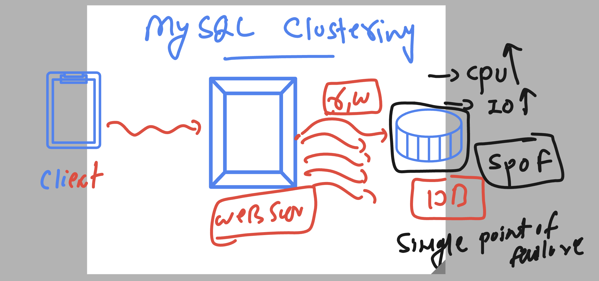
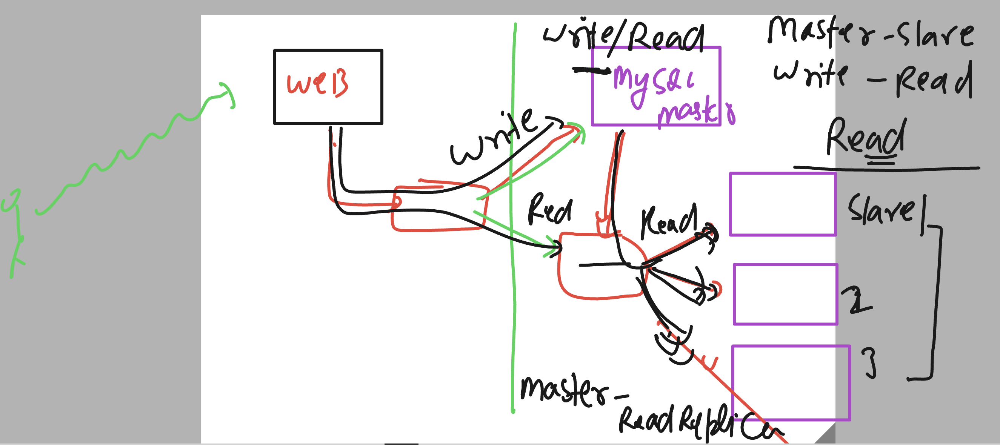
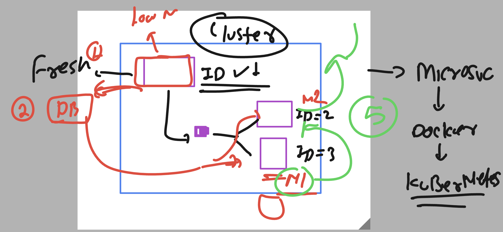
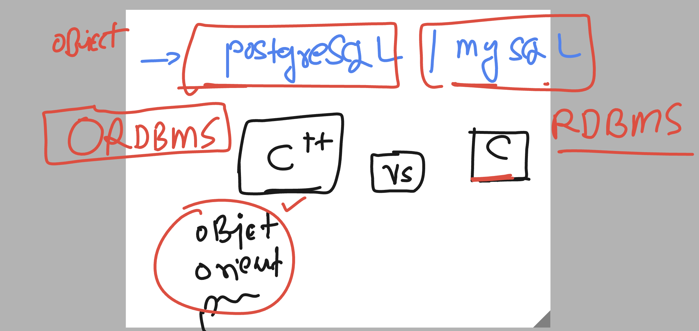

### Understanding 


## Installing mysql on rhel9 

### 

```
[root@ip-172-31-17-219 ~]# yum  install mysql-server 
Updating Subscription Management repositories.
Unable to read consumer identity

This system is not registered with an entitlement server. You can use subscription-manager to register.

Last metadata expiration check: 0:00:19 ago on Fri 16 Jun 2023 06:04:19 AM UTC.
Dependencies resolved.
=============================================================================================================================================================
 Package                                     Architecture            Version                               Repository                                   Size
=============================================================================================================================================================
Installing:
 mysql-server                                x86_64                  8.0.32-1.el9_2                        rhel-9-appstream-rhui-rpms                   17 M
Installing dependencies:
 libaio                                      x86_64                  0.3.111-13.el9                        rhel-9-baseos-rhui-rpms                      26 k
 libicu                                      
```

### starting servcie

```
Complete!
[root@ip-172-31-17-219 ~]# rpm -qc mysql-server
/etc/logrotate.d/mysqld
/etc/my.cnf.d/mysql-server.cnf
/var/log/mysql/mysqld.log
[root@ip-172-31-17-219 ~]# 
[root@ip-172-31-17-219 ~]# 
[root@ip-172-31-17-219 ~]# cd  /etc/my.cnf.d/
[root@ip-172-31-17-219 my.cnf.d]# ls
client.cnf  mysql-server.cnf
[root@ip-172-31-17-219 my.cnf.d]# 
[root@ip-172-31-17-219 my.cnf.d]# systemctl start mysqld
[root@ip-172-31-17-219 my.cnf.d]# systemctl enable mysqld
Created symlink /etc/systemd/system/multi-user.target.wants/mysqld.service → /usr/lib/systemd/system/mysqld.service.
[root@ip-172-31-17-219 my.cnf.d]# 
[root@ip-172-31-17-219 my.cnf.d]# systemctl status  mysqld
● mysqld.service - MySQL 8.0 database server
     Loaded: loaded (/usr/lib/systemd/system/mysqld.service; enabled; preset: disabled)
     Active: active (running) since Fri 2023-06-16 06:05:52 UTC; 14s ago
   Main PID: 15236 (mysqld)
     Status: "Server is operational"
      Tasks: 39 (limit: 10863)
     Memory: 454.9M
        CPU: 4.312s

```

### setting password 

```
[root@ip-172-31-17-219 my.cnf.d]# mysql_secure_installation 

Securing the MySQL server deployment.

Connecting to MySQL using a blank password.

VALIDATE PASSWORD COMPONENT can be used to test passwords
and improve security. It checks the strength of password
and allows the users to set only those passwords which are
secure enough. Would you like to setup VALIDATE PASSWORD component?

Press y|Y for Yes, any other key for No: 
Please set the password for root here.

New password: 

Re-enter new password: 
By default, a MySQL installation has an anonymous user,
allowing anyone to log into MySQL without having to have
a user account created for them. This is int
```

### login and testing 

```
[root@ip-172-31-17-219 ~]# mysql -u root -p
Enter password: 
Welcome to the MySQL monitor.  Commands end with ; or \g.
Your MySQL connection id is 10
Server version: 8.0.32 Source distribution

Copyright (c) 2000, 2023, Oracle and/or its affiliates.

Oracle is a registered trademark of Oracle Corporation and/or its
affiliates. Other names may be trademarks of their respective
owners.

Type 'help;' or '\h' for help. Type '\c' to clear the current input statement.

mysql> show databases;
+--------------------+
| Database           |
+--------------------+
| information_schema |
| mysql              |
| performance_schema |
| sys                |
+--------------------+
4 rows in set (0.00 sec)

mysql> create  database hellofss;
Query OK, 1 row affected (0.01 sec)

mysql> use hellofss;
Database changed
mysql> show tables;
Empty set (0.00 sec)

```

### some useful commands 

```
 9  yum history list
   10  dnf  history list
   11  yum history undo  2
   12  yum history undo  3
   13  dnf  history list
   14  yum history undo  2
   15  yum install mysql-server
   16  rpm -qa  mysql*
   17  rpm -qa  |  grep -in mysql*
   18  yum install mysql-server  --skip-broken
   19  yum install mysql-server  --skip-broken --nobest
```


## Problem with Single Instance of Db 



## Master and Read replication type db cluster in mysql 



### two cases of db clustering in above setup



## setup of MYsql master and one Read replication (slave)

### Requirements 

### vm1 & vm2 

### Vm1 -- master &  vm2 as slave 

### Things to do on both VM 

<ol>
  <li> Install mysql-server </li>
   <li> configure mysql-server </li>
   <li> start servcie  </li>
   <li> setup root password  </li>
 
</ol>


### Things to verify in both vm 

```
[root@mysql-master ~]# rpm -q mysql-server 
mysql-server-8.0.32-1.el9_2.x86_64
[root@mysql-master ~]# 
[root@mysql-master ~]# systemctl status mysqld
● mysqld.service - MySQL 8.0 database server
     Loaded: loaded (/usr/lib/systemd/system/mysqld.service; enabled; preset: disabled)
     Active: active (running) since Fri 2023-06-16 06:05:52 UTC; 2h 33min ago
   Main PID: 15236 (mysqld)
     Status: "Server is operational"
      Tasks: 39 (limit: 10863)
     Memory: 476.6M
        CPU: 31.995s
     CGroup: /system.slice/mysqld.service
             └─15236 /usr/libexec/mysqld --basedir=/usr

Jun 16 06:05:42 ip-172-31-17-219.us-east-2.compute.internal systemd[1]: Starting MySQL 8.0 database server...
Jun 16 06:05:42 ip-172-31-17-219.us-east-2.compute.internal mysql-prepare-db-dir[15163]: Initializing MySQL database
Jun 16 06:05:52 ip-172-31-17-219.us-east-2.compute.internal systemd[1]: Started MySQL 8.0 database server.
[root@mysql-master ~]# 
[root@mysql-master ~]# 
[root@mysql-master ~]# mysql -u root -p
Enter password: 
Welcome to the MySQL monitor.  Commands end with ; or \g.
Your MySQL connection id is 11
Server version: 8.0.32 Source distribution

Copyright (c) 2000, 2023, Oracle and/or its affiliates.

Oracle is a registered trademark of Oracle Corporation and/or its
affiliates. Other names may be trademarks of their respective
owners.

Type 'help;' or '\h' for help. Type '\c' to clear the current input statement.

mysql> ^DBye

```

## COnfigure Master server 

### checking configuration directory 

```
[root@mysql-master ~]# cd  /etc/my.cnf.d/
[root@mysql-master my.cnf.d]# ls
client.cnf  mysql-server.cnf
[root@mysql-master my.cnf.d]# 
[root@mysql-master my.cnf.d]# 
[root@mysql-master my.cnf.d]# cat  /etc/my.cnf 
#
# This group is read both both by the client and the server
# use it for options that affect everything
#
[client-server]

#
# include all files from the config directory
#
!includedir /etc/my.cnf.d

[root@mysql-master my.cnf.d]#

=========>

```

### fixing some server id 

```
ls
client.cnf  mysql-server.cnf
[root@mysql-master my.cnf.d]# vim mysql-server.cnf 
[root@mysql-master my.cnf.d]# cat  mysql-server.cnf 
#
# This group are read by MySQL server.
# Use it for options that only the server (but not clients) should see
#
# For advice on how to change settings please see
# http://dev.mysql.com/doc/refman/en/server-configuration-defaults.html

# Settings user and group are ignored when systemd is used.
# If you need to run mysqld under a different user or group,
# customize your systemd unit file for mysqld according to the
# instructions in http://fedoraproject.org/wiki/Systemd

[mysqld]
datadir=/var/lib/mysql
socket=/var/lib/mysql/mysql.sock
log-error=/var/log/mysql/mysqld.log
pid-file=/run/mysqld/mysqld.pid

# defining id of mysql master machine
server-id = 1
[root@mysql-master my.cnf.d]#

=======> Restart service

[root@mysql-master my.cnf.d]# systemctl restart mysqld
```

### create a user for replication purpose in master server

```
mysql -u root -p
Enter password: 
Welcome to the MySQL monitor.  Commands end with ; or \g.
Your MySQL connection id is 8
Server version: 8.0.32 Source distribution

Copyright (c) 2000, 2023, Oracle and/or its affiliates.

Oracle is a registered trademark of Oracle Corporation and/or its
affiliates. Other names may be trademarks of their respective
owners.

Type 'help;' or '\h' for help. Type '\c' to clear the current input statement.

mysql> create user  'replica'@'%' identified by 'Redhat@123';
Query OK, 0 rows affected (0.02 sec)

mysql> grant REPLICATION SLAVE , REPLICATION CLIENT on  *.*  to  'replica'@'%';
Query OK, 0 rows affected (0.00 sec)

mysql> flush privileges;
Query OK, 0 rows affected (0.00 sec)

mysql> FLUSH TABLES with read lock;
Query OK, 0 rows affected (0.00 sec)

mysql> 
mysql> show master status;
+---------------+----------+--------------+------------------+-------------------+
| File          | Position | Binlog_Do_DB | Binlog_Ignore_DB | Executed_Gtid_Set |
+---------------+----------+--------------+------------------+-------------------+
| binlog.000002 |      883 |              |                  |                   |
+---------------+----------+--------------+------------------+-------------------+
1 row in set (0.00 sec)

```

## Done with Master side changes 

# COnfigure Slave to connect master 

### configure server-id here alos

```
root@mysql-read1 ~]# cd  /etc/my.cnf.d/
[root@mysql-read1 my.cnf.d]# ls
client.cnf  mysql-server.cnf
[root@mysql-read1 my.cnf.d]# vim mysql-server.cnf 
[root@mysql-read1 my.cnf.d]# cat mysql-server.cnf 
#
# This group are read by MySQL server.
# Use it for options that only the server (but not clients) should see
#
# For advice on how to change settings please see
# http://dev.mysql.com/doc/refman/en/server-configuration-defaults.html

# Settings user and group are ignored when systemd is used.
# If you need to run mysqld under a different user or group,
# customize your systemd unit file for mysqld according to the
# instructions in http://fedoraproject.org/wiki/Systemd

[mysqld]
datadir=/var/lib/mysql
socket=/var/lib/mysql/mysql.sock
log-error=/var/log/mysql/mysqld.log
pid-file=/run/mysqld/mysqld.pid

# server id of slave machine 
server-id = 2 
[root@mysql-read1 my.cnf.d]# systemctl restart mysql 
Failed to restart mysql.service: Unit mysql.service not found.
[root@mysql-read1 my.cnf.d]# systemctl restart mysqld
[root@mysql-read1 my.cnf.d]# systemctl status  mysqld
● mysqld.service - MySQL 8.0 database server
     Loaded: loaded (/usr/lib/systemd/system/mysqld.service; enabled; preset: disabled)
     Active: active (running) since Fri 2023-06-16 08:51:13 UTC; 7s ago
    Process: 15843 ExecStartPre=/usr/libexec/mysql-check-socket (code=exited, status=0/SUCCESS)
    Process: 15865 ExecStartPre=/usr/libexec/mysql-prepare-db-dir mysqld.service (code=exited, status=0/SUCCESS)
   Main PID: 15899 (mysqld)
     Status: "Server is operational"
      Tasks: 39 (limit: 10863)
     Memory: 368.4M
        CPU: 872ms
     CGroup: /system.slice/mysqld.service
             └─15899 /usr/libexec/mysqld --basedir=/usr


```

### Connecting mysql master server

```
[root@mysql-read1 my.cnf.d]# mysql -u root -p
Enter password: 
Welcome to the MySQL monitor.  Commands end with ; or \g.
Your MySQL connection id is 8
Server version: 8.0.32 Source distribution

Copyright (c) 2000, 2023, Oracle and/or its affiliates.

Oracle is a registered trademark of Oracle Corporation and/or its
affiliates. Other names may be trademarks of their respective
owners.

Type 'help;' or '\h' for help. Type '\c' to clear the current input statement.

mysql> change master to 
    -> MASTER_HOST='172.31.17.219',
    -> MASTER_USER='replica',
    -> MASTER_PASSWORD='Redhat@123',
    -> MASTER_PORT=3306,
    -> MASTER_CONNECT_RETRY=9,
    -> MASTER_LOG_FILE='binlog.000002';
Query OK, 0 rows affected, 10 warnings (0.02 sec)

mysql> start slave;
Query OK, 0 rows affected, 1 warning (0.01 sec)

mysql> show slave status;

```

## POstgresSQL and mysql 




