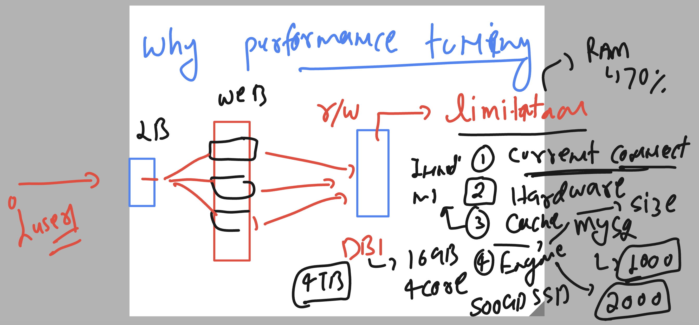
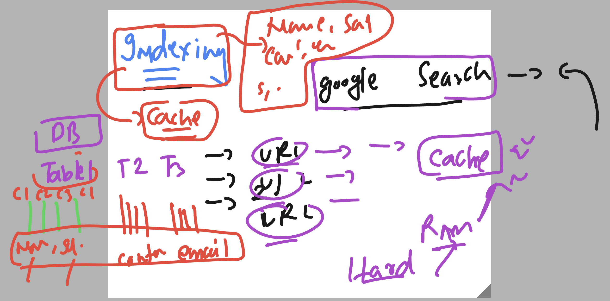

# Performance Tuning 

### Understanding 



### some common point to be taken care for tuning mysql db 

```
1. Indexing 

2. Query optimization

3. Configuration settings

4. Caching

5. Partitioning

6. Connection pooling

7. Buffering

8. Regular maintenance

9. Hardware upgrades
****
```

### Installing mysql-server

```
[root@ip-172-31-19-149 ~]# history 
    1  cat /etc/os-release 
    2  rpm -qa mysql* 
    3  yum install mysql-server -y
    4  history 
[root@ip-172-31-19-149 ~]# rpm -qc  mysql-server
/etc/logrotate.d/mysqld
/etc/my.cnf.d/mysql-server.cnf
/var/log/mysql/mysqld.log

```
## Concept of Indexing in mysql Db 


### creating database and table and insert some data

```
[root@ip-172-31-19-149 ~]# mysql -u root -p
Enter password: 
Welcome to the MySQL monitor.  Commands end with ; or \g.
Your MySQL connection id is 10
Server version: 8.0.32 Source distribution

Copyright (c) 2000, 2023, Oracle and/or its affiliates.

Oracle is a registered trademark of Oracle Corporation and/or its
affiliates. Other names may be trademarks of their respective
owners.

Type 'help;' or '\h' for help. Type '\c' to clear the current input statement.

mysql> create database testdb;
Query OK, 1 row affected (0.01 sec)

mysql> use testdb
Database changed
mysql> create table emp (
    -> id INT NOT NULL AUTO_INCREMENT PRIMARY KEY,
    -> name char(20) not null,
    -> email varchar(30) not null,
    -> contact int(10) not null,
    -> remarks varchar(50) not null
    -> );
Query OK, 0 rows affected, 1 warning (0.02 sec)

mysql> show tables;
+------------------+
| Tables_in_testdb |
+------------------+
| emp              |
+------------------+
1 row in set (0.00 sec)

mysql> desc emp;
+---------+-------------+------+-----+---------+----------------+
| Field   | Type        | Null | Key | Default | Extra          |
+---------+-------------+------+-----+---------+----------------+
| id      | int         | NO   | PRI | NULL    | auto_increment |
| name    | char(20)    | NO   |     | NULL    |                |
| email   | varchar(30) | NO   |     | NULL    |                |
| contact | int         | NO   |     | NULL    |                |
| remarks | varchar(50) | NO   |     | NULL    |                |
+---------+-------------+------+-----+---------+----------------+
5 rows in set (0.00 sec)


mysql> insert into emp (name,email,contact,remarks) values  ('ashu','ashutoshh@linu.com',1234567891,'ok cool');
Query OK, 1 row affected (0.01 sec)

mysql> insert into emp (name,email,contact,remarks) values  ('fssadmin','fss@linu.com',1234567891,'ok cool');
Query OK, 1 row affected (0.00 sec)

mysql> select * from emp;
+----+----------+--------------------+------------+---------+
| id | name     | email              | contact    | remarks |
+----+----------+--------------------+------------+---------+
|  1 | ashu     | ashutoshh@linu.com | 1234567891 | ok cool |
|  2 | fssadmin | fss@linu.com       | 1234567891 | ok cool |
+----+----------+--------------------+------------+---------+
2 rows in set (0.00 sec)


```


