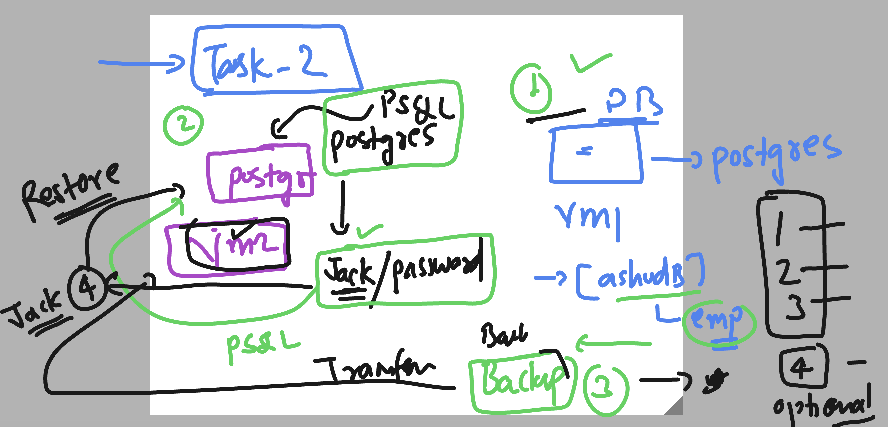
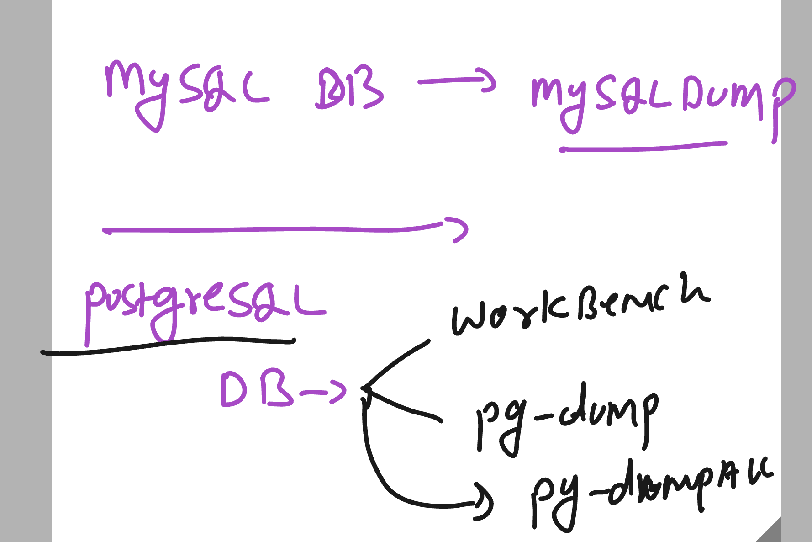
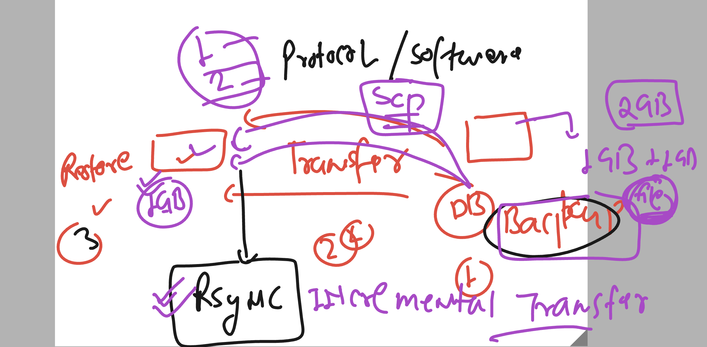

# fss-apache-training

## Postgresql info 

### documentation 

[click_here]('https://www.postgresql.org/docs/')

## Installing postgresql on RHEL 9 

### os version 

```
[root@ip-172-31-28-149 ~]# cat /etc/os-release 
NAME="Red Hat Enterprise Linux"
VERSION="9.2 (Plow)"
ID="rhel"
ID_LIKE="fedora"

```

### search for package of postgresql 

```
[root@ip-172-31-28-149 ~]# yum search  postgresql 
Updating Subscription Management repositories.
Unable to read consumer identity

This system is not registered with an entitlement server. You can use subscription-manager to register.

Red Hat Enterprise Linux 9 for x86_64 - AppStream from RHUI (RPMs)                                                            24 MB/s |  21 MB     00:00    
Red Hat Enterprise Linux 9 for x86_64 - BaseOS from RHUI (RPMs)                                                               17 MB/s |  12 MB     00:00    
Red Hat Enterprise Linux 9 Client Configuration                                                                               26 kB/s | 3.0 kB     00:00    
============================================================ Name & Summary Matched: postgresql =============================================================
postgresql.x86_64 : PostgreSQL client programs
pcp-pmda-postgresql.x86_64 : Performance Co-Pilot (PCP) metrics for PostgreSQL
postgresql-contrib.x86_64 : Extension modules distributed with PostgreSQL
postgresql-jdbc.noarch : JDBC driver for PostgreSQL
postgresql-odbc.x86_64 : PostgreSQL ODBC driver
postgresql-plperl.x86_64 : The Perl procedural language for PostgreSQL
postgresql-plpython3.x86_64 : The Python3 procedural language for PostgreSQL
postgresql-pltcl.x86_64 : The Tcl procedural language for PostgreSQL
postgresql-private-libs.x86_64 : The shared libraries required only for this build of PostgreSQL server
postgresql-server.x86_64 : The programs needed to create and run a PostgreSQL server
postgresql-upgrade.x86_64 : Support for upgrading from the previous major release of PostgreSQL
qt5-qtbase-postgresql.x86_64 : PostgreSQL driver for Qt5's SQL classes
qt5-qtbase-postgresql.i686 : PostgreSQL driver for Qt5's SQL classes
tuned-profiles-postgresql.noarch : Additional tuned profile(s) targeted to PostgreSQL server loads
==================================================
```

### Install postgresql 13 

```
[root@ip-172-31-28-149 ~]# dnf install postgresql-server
Updating Subscription Management repositories.
Unable to read consumer identity

This system is not registered with an entitlement server. You can use subscription-manager to register.

Last metadata expiration check: 0:03:35 ago on Fri 16 Jun 2023 10:52:03 AM UTC.
Dependencies resolved.
=============================================================================================================================================================
 Package                                    Architecture              Version                            Repository                                     Size
=============================================================================================================================================================
Installing:
 postgresql-server                          x86_64                    13.10-1.el9_1                      rhel-9-appstream-rhui-rpms                    5.8 M
Installing dependencies:
 libicu                                     x86_64                    67.1-9.el9                         rhel-9-baseos-rhui-rpms                       9.6 M
 postgresql                                 x86_64                    13.10-1.el9_1                      rhel-9-appstream-rhui-rpms                    1.6 M
 postgresql-private-libs               
```

### if want to install postgresql 15

```
dnf  module  install postgresql:15/server
```

## Initailize configuration 

```
[root@ip-172-31-28-149 ~]# postgresql-setup  --initdb 
 * Initializing database in '/var/lib/pgsql/data'
 * Initialized, logs are in /var/lib/pgsql/initdb_postgresql.log
[root@ip-172-31-28-149 ~]#  

```

### start the service

```
[root@ip-172-31-28-149 ~]# systemctl start postgresql 
[root@ip-172-31-28-149 ~]# systemctl status postgresql 
● postgresql.service - PostgreSQL database server
     Loaded: loaded (/usr/lib/systemd/system/postgresql.service; disabled; preset: disabled)
     Active: active (running) since Fri 2023-06-16 11:06:37 UTC; 6s ago
    Process: 14555 ExecStartPre=/usr/libexec/postg

root@ip-172-31-28-149 ~]# systemctl enable  postgresql 
Created symlink /etc/systemd/system/multi-user.target.wants/postgresql.service → /usr/lib/systemd/system/postgresql.service.
[root@ip-172-31-28-149 ~]# 


```

### understnading local and remote client connection 


### checking default port number 

```
[root@ip-172-31-28-149 ~]# ss -nltp
State         Recv-Q        Send-Q                 Local Address:Port                 Peer Address:Port        Process                                       
LISTEN        0             128                          0.0.0.0:22                        0.0.0.0:*            users:(("sshd",pid=969,fd=3))                
LISTEN        0             244                        127.0.0.1:5432                      0.0.0.0:*            users:(("postmaster",pid=14557,fd=
```

### Understading psql role with unix / linux system 

```
[root@ip-172-31-28-149 ~]# psql  
psql: error: FATAL:  role "root" does not exist
[root@ip-172-31-28-149 ~]# exit\
> ^C
[root@ip-172-31-28-149 ~]# exit
logout
[ec2-user@ip-172-31-28-149 ~]$ 
[ec2-user@ip-172-31-28-149 ~]$ whoami
ec2-user
[ec2-user@ip-172-31-28-149 ~]$ psql 
psql: error: FATAL:  role "ec2-user" does not exist
[ec2-user@ip-172-31-28-149 ~]$ sudo -i
[root@ip-172-31-28-149 ~]# grep -i postgres  /etc/passwd
postgres:x:26:26:PostgreSQL Server:/var/lib/pgsql:/bin/bash
[root@ip-172-31-28-149 ~]# 
[root@ip-172-31-28-149 ~]# 
[root@ip-172-31-28-149 ~]# su - postgres 
[postgres@ip-172-31-28-149 ~]$ 
[postgres@ip-172-31-28-149 ~]$ whoami
postgres
[postgres@ip-172-31-28-149 ~]$ psql 
psql (13.10)
Type "help" for help.

postgres=# \q
[postgres@ip-172-31-28-149 ~]$ 

```

### connecting from postgres system user to run psql command

```
[postgres@ip-172-31-28-149 ~]$ psql 
psql (13.10)
Type "help" for help.

postgres=# \conninfo 
You are connected to database "postgres" as user "postgres" via socket in "/var/run/postgresql" at port "5432".
postgres=# 


```

# POstgreSQL as per the best practice 


### installing and see the changes on system 

```
[root@ip-172-31-26-24 ~]# hostnamectl 
 Static hostname: ip-172-31-26-24.us-east-2.compute.internal
       Icon name: computer-vm
         Chassis: vm 🖴
      Machine ID: 81e4e09b3d3c463f8b45ba854caa3ed7
         Boot ID: 164dafb565e345539375c4345ab91836
  Virtualization: xen
Operating System: Red Hat Enterprise Linux 9.2 (Plow)       
     CPE OS Name: cpe:/o:redhat:enterprise_linux:9::baseos
          Kernel: Linux 5.14.0-284.11.1.el9_2.x86_64
    Architecture: x86-64
 Hardware Vendor: Xen
  Hardware Model: HVM domU
Firmware Version: 4.11.amazon
[root@ip-172-31-26-24 ~]# 
[root@ip-172-31-26-24 ~]# rpm -qa postgresql* 
[root@ip-172-31-26-24 ~]# 
[root@ip-172-31-26-24 ~]# 
[root@ip-172-31-26-24 ~]# grep -in postgres  /etc/passwd
[root@ip-172-31-26-24 ~]# 
[root@ip-172-31-26-24 ~]# dnf install postgresql-server -y  &>/dev/null 
[root@ip-172-31-26-24 ~]# rpm -qa postgresql* 
postgresql-private-libs-13.10-1.el9_1.x86_64
postgresql-13.10-1.el9_1.x86_64
postgresql-server-13.10-1.el9_1.x86_64
[root@ip-172-31-26-24 ~]# 
[root@ip-172-31-26-24 ~]# grep -in postgres  /etc/passwd
23:postgres:x:26:26:PostgreSQL Server:/var/lib/pgsql:/bin/bash
[root@ip-172-31-26-24 ~]# 

```

## Postgresql with user relation 


### initialize database by default profile

```
[root@ip-172-31-26-24 ~]# postgresql-setup   --initdb 
 * Initializing database in '/var/lib/pgsql/data'
 * Initialized, logs are in /var/lib/pgsql/initdb_postgresql.log
```


### checking more details

```
[root@ip-172-31-26-24 ~]# cd /var/lib/pgsql/
[root@ip-172-31-26-24 pgsql]# ls
backups  data  initdb_postgresql.log
[root@ip-172-31-26-24 pgsql]# tail -f initdb_postgresql.log 
selecting default time zone ... UTC
creating configuration files ... ok
running bootstrap script ... ok
performing post-bootstrap initialization ... ok
syncing data to disk ... ok

Success. You can now start the database server using:

    /usr/bin/pg_ctl -D /var/lib/pgsql/data -l logfile start

^C
[root@ip-172-31-26-24 pgsql]# ls
backups  data  initdb_postgresql.log
[root@ip-172-31-26-24 pgsql]# cd  data/
[root@ip-172-31-26-24 data]# ls
base    pg_commit_ts  pg_ident.conf  pg_notify    pg_snapshots  pg_subtrans  PG_VERSION  postgresql.auto.conf
global  pg_dynshmem   pg_logical     pg_replslot  pg_stat       pg_tblspc    pg_wal      postgresql.conf
log     pg_hba.conf   pg_multixact   pg_serial    pg_stat_tmp   pg_twophase  pg_xact
[root@ip-172-31-26-24 data]# 

```

### starting and enable service

```
[root@ip-172-31-26-24 data]# systemctl start postgresql.service 
[root@ip-172-31-26-24 data]# systemctl status  postgresql.service 
● postgresql.service - PostgreSQL database server
     Loaded: loaded (/usr/lib/systemd/system/postgresql.service; disabled; preset: disabled)
     Active: active (running) since Sat 2023-06-17 06:50:00 UTC; 6s ago
    Process: 14604 ExecStartPre=/usr/libexec/postgresql-check-db-dir postgresql (code=exited, status=0/SUCCESS)
   Main PID: 14606 (postmaster)
      Tasks: 8 (limit: 10863)
     Memory: 16.5M
        CPU: 48ms
     CGroup: /system.slice/postgresql.service
             ├─14606 /usr/bin/postmaster -D /var/lib/pgsql/data
             ├─14607 "postgres: logger "
             ├─14609 "postgres: checkpointer "
             ├─14610 "postgres: background writer "
             ├─14611 "postgres: walwriter "
             ├─14612 "postgres: autovacuum launcher "
             ├─14613 "postgres: stats collector "
             └─14614 "postgres: logical replication launcher "

Jun 17 06:50:00 ip-172-31-26-24.us-east-2.compute.internal systemd[1]: Starting PostgreSQL database server...
Jun 17 06:50:00 ip-172-31-26-24.us-east-2.compute.internal postmaster[14606]: 2023-06-17 06:50:00.400 UTC [14606] LOG:  redirecting log output to logging co>
Jun 17 06:50:00 ip-172-31-26-24.us-east-2.compute.internal postmaster[14606]: 2023-06-17 06:50:00.400 UTC [14606] HINT:  Future log output will appear in di>
Jun 17 06:50:00 ip-172-31-26-24.us-east-2.compute.internal systemd[1]: Started PostgreSQL database server.
[root@ip-172-31-26-24 data]# systemctl enable  postgresql.service 
```

## Connecting to postgresql -- postmaster daemon from client software

### creating password for system user postgres
```
root@ip-172-31-26-24 ~]# grep -in postgres  /etc/passwd
23:postgres:x:26:26:PostgreSQL Server:/var/lib/pgsql:/bin/bash
[root@ip-172-31-26-24 ~]# 
[root@ip-172-31-26-24 ~]# 
[root@ip-172-31-26-24 ~]# grep -in postgres  /etc/shadow
23:postgres:!!:19525::::::
[root@ip-172-31-26-24 ~]# 
[root@ip-172-31-26-24 ~]# 
[root@ip-172-31-26-24 ~]# passwd postgres 
Changing password for user postgres.
New password: 
BAD PASSWORD: The password is shorter than 8 characters
Retype new password: 
passwd: all authentication tokens updated successfully.
[root@ip-172-31-26-24 ~]# 
[root@ip-172-31-26-24 ~]# 
[root@ip-172-31-26-24 ~]# 
logout
[ec2-user@ip-172-31-26-24 ~]$ 
[ec2-user@ip-172-31-26-24 ~]$ su  - postgres 
Password: 
[postgres@ip-172-31-26-24 ~]$ id
uid=26(postgres) gid=26(postgres) groups=26(postgres) context=unconfined_u:unconfined_r:unconfined_t:s0-s0:c0.c1023
[postgres@ip-172-31-26-24 ~]$ 


```

### PSQL is using RBAC which need to match system user with database user by default

```
[root@ip-172-31-26-24 ~]# id
uid=0(root) gid=0(root) groups=0(root) context=unconfined_u:unconfined_r:unconfined_t:s0-s0:c0.c1023
[root@ip-172-31-26-24 ~]# whoami
root
[root@ip-172-31-26-24 ~]# 
[root@ip-172-31-26-24 ~]# psql
psql: error: FATAL:  role "root" does not exist
[root@ip-172-31-26-24 ~]# 
[root@ip-172-31-26-24 ~]# su - ec2-user
Last login: Sat Jun 17 06:31:42 UTC 2023 from 103.59.75.217 on pts/0
[ec2-user@ip-172-31-26-24 ~]$ 
[ec2-user@ip-172-31-26-24 ~]$ 
[ec2-user@ip-172-31-26-24 ~]$ whoami
ec2-user
[ec2-user@ip-172-31-26-24 ~]$ psql 
psql: error: FATAL:  role "ec2-user" does not exist
[ec2-user@ip-172-31-26-24 ~]$ exit
logout
[root@ip-172-31-26-24 ~]# su - ec2-user
Last login: Sat Jun 17 07:01:41 UTC 2023 on pts/0
[ec2-user@ip-172-31-26-24 ~]$ 
[ec2-user@ip-172-31-26-24 ~]$ exit
logout
[root@ip-172-31-26-24 ~]# su - postgres 
Last login: Sat Jun 17 06:57:30 UTC 2023 on pts/0
[postgres@ip-172-31-26-24 ~]$ 
[postgres@ip-172-31-26-24 ~]$ whoami
postgres
[postgres@ip-172-31-26-24 ~]$ psql 
psql (13.10)
Type "help" for help.

postgres=# 
postgres=# 

```


## SQL query of postgres

### taking help

```
[postgres@ip-172-31-26-24 ~]$ psql 
psql (13.10)
Type "help" for help.

postgres=# 
postgres=# 
postgres=# \h
Available help:
  ABORT                            CHECKPOINT                       CREATE USER                      DROP TRIGGER
  ALTER AGGREGATE                  CLOSE                            CREATE USER MAPPING              DROP TYPE
  ALTER COLLATION                  CLUSTER                          CREATE VIEW                      DROP USER
  ALTER CONVERSION                 COMMENT                          DEALLOCATE                       DROP USER MAPPING
  ALTER DATABASE                   COMMIT                           DECLARE                          DROP VIEW
  ALTER DEFAULT PRIVILEGES         COMMIT PREPARED                  DELETE                           END
  ALTER DOMAIN                     COPY                             DISCARD                          EXECUTE

```

### listing databases 

```
postgres=# \l
                                  List of databases
   Name    |  Owner   | Encoding |   Collate   |    Ctype    |   Access privileges   
-----------+----------+----------+-------------+-------------+-----------------------
 postgres  | postgres | UTF8     | en_US.UTF-8 | en_US.UTF-8 | 
 template0 | postgres | UTF8     | en_US.UTF-8 | en_US.UTF-8 | =c/postgres          +
           |          |          |             |             | postgres=CTc/postgres
 template1 | postgres | UTF8     | en_US.UTF-8 | en_US.UTF-8 | =c/postgres          +
           |          |          |             |             | postgres=CTc/postgres
(3 rows)

postgres=# 
postgres=# \list
                                  List of databases
   Name    |  Owner   | Encoding |   Collate   |    Ctype    |   Access privileges   
-----------+----------+----------+-------------+-------------+-----------------------
 postgres  | postgres | UTF8     | en_US.UTF-8 | en_US.UTF-8 | 
 template0 | postgres | UTF8     | en_US.UTF-8 | en_US.UTF-8 | =c/postgres          +
           |          |          |             |             | postgres=CTc/postgres
 template1 | postgres | UTF8     | en_US.UTF-8 | en_US.UTF-8 | =c/postgres          +
           |          |          |             | 
```

### creating database

```
ostgres=# CREATE DATABASE ashudb;
CREATE DATABASE
postgres=# \l
                                  List of databases
   Name    |  Owner   | Encoding |   Collate   |    Ctype    |   Access privileges   
-----------+----------+----------+-------------+-------------+-----------------------
 ashudb    | postgres | UTF8     | en_US.UTF-8 | en_US.UTF-8 | 
 postgres  | postgres | UTF8     | en_US.UTF-8 | en_US.UTF-8 | 

```

### switch to database you create

```
postgres=# \c ashudb
You are now connected to database "ashudb" as user "postgres".
ashudb=# 
ashudb=# 

```

### checking table (relation) in the database

```
ashudb=# \dt
Did not find any relations.
ashudb=# 
ashudb=# 


```

## Creating table im postgresql 

```
ashudb=# \dt
Did not find any relations.
ashudb=# 
ashudb=# create table  emp (
ashudb(# id SERIAL primary key ,
ashudb(# name char(20) not null,
ashudb(# email varchar(30) not null,
ashudb(# remarks varchar(50) 
ashudb(# );
CREATE TABLE
ashudb=# \dt
        List of relations
 Schema | Name | Type  |  Owner   
--------+------+-------+----------
 public | emp  | table | postgres
(1 row)


```

### checking schema of table 

```
ashudb=# \d   emp ;
                                    Table "public.emp"
 Column  |         Type          | Collation | Nullable |             Default             
---------+-----------------------+-----------+----------+---------------------------------
 id      | integer               |           | not null | nextval('emp_id_seq'::regclass)
 name    | character(20)         |           | not null | 
 email   | character varying(30) |           | not null | 
 remarks | character varying(50) |           |          | 
Indexes:
    "emp_pkey" PRIMARY KEY, btree (id)

\d: extra argument ";" ignored

```

### Revision 

```
[ec2-user@ip-172-31-26-24 ~]$ su - postgres 
Password: 
Last login: Sat Jun 17 07:05:05 UTC 2023 on pts/0
[postgres@ip-172-31-26-24 ~]$ 
[postgres@ip-172-31-26-24 ~]$ 
[postgres@ip-172-31-26-24 ~]$ whoami
postgres
[postgres@ip-172-31-26-24 ~]$ psql 
psql (13.10)
Type "help" for help.

postgres=# \l
                                  List of databases
   Name    |  Owner   | Encoding |   Collate   |    Ctype    |   Access privileges   
-----------+----------+----------+-------------+-------------+-----------------------
 ashudb    | postgres | UTF8     | en_US.UTF-8 | en_US.UTF-8 | 
 postgres  | postgres | UTF8     | en_US.UTF-8 | en_US.UTF-8 | 
 template0 | postgres | UTF8     | en_US.UTF-8 | en_US.UTF-8 | =c/postgres          +
           |          |          |             |             | postgres=CTc/postgres
 template1 | postgres | UTF8     | en_US.UTF-8 | en_US.UTF-8 | =c/postgres          +
           |          |          |             |             | postgres=CTc/postgres
(4 rows)

postgres=# \c ashudb
You are now connected to database "ashudb" as user "postgres".
ashudb=# \d
             List of relations
 Schema |    Name    |   Type   |  Owner   
--------+------------+----------+----------
 public | emp        | table    | postgres
 public | emp_id_seq | sequence | postgres
(2 rows)

ashudb=# \d emp
                                    Table "public.emp"
 Column  |         Type          | Collation | Nullable |             Default             
---------+-----------------------+-----------+----------+---------------------------------
 id      | integer               |           | not null | nextval('emp_id_seq'::regclass)
 name    | character(20)         |           | not null | 
 email   | character varying(30) |           | not null | 
 remarks | character varying(50) |           |          | 
Indexes:
    "emp_pkey" PRIMARY KEY, btree (id)


```

### insert data in table

```
shudb=# \d emp
                                    Table "public.emp"
 Column  |         Type          | Collation | Nullable |             Default             
---------+-----------------------+-----------+----------+---------------------------------
 id      | integer               |           | not null | nextval('emp_id_seq'::regclass)
 name    | character(20)         |           | not null | 
 email   | character varying(30) |           | not null | 
 remarks | character varying(50) |           |          | 
Indexes:
    "emp_pkey" PRIMARY KEY, btree (id)

ashudb=# INSERT INTO emp (name,email)
ashudb-# values 
ashudb-# ('ashu','ashutoshh@linux.com'),
ashudb-# ('tr','tr@google.com');
INSERT 0 2
ashudb=# 

```

### read info 

```
ashudb=# select * from emp;
 id |         name         |        email        | remarks 
----+----------------------+---------------------+---------
  1 | ashu                 | ashutoshh@linux.com | 
  2 | tr                   | tr@google.com       | 
(2 rows)

ashudb=# select email  from emp;
        email        
---------------------
 ashutoshh@linux.com
 tr@google.com
(2 rows)

ashudb=# select email  from emp where id=1;
        email        
---------------------
 ashutoshh@linux.com
(1 row)

ashudb=# \q

```

## Task 2 



##  Backup of ANy database -- 



### taking backup of postgresql --using pg_dump

```
[postgres@ip-172-31-26-24 ~]$ id
uid=26(postgres) gid=26(postgres) groups=26(postgres) context=unconfined_u:unconfined_r:unconfined_t:s0-s0:c0.c1023
[postgres@ip-172-31-26-24 ~]$ 
[postgres@ip-172-31-26-24 ~]$ psql 
psql (13.10)
Type "help" for help.

postgres=# \l
                                  List of databases
   Name    |  Owner   | Encoding |   Collate   |    Ctype    |   Access privileges   
-----------+----------+----------+-------------+-------------+-----------------------
 ashudb    | postgres | UTF8     | en_US.UTF-8 | en_US.UTF-8 | 
 postgres  | postgres | UTF8     | en_US.UTF-8 | en_US.UTF-8 | 
 template0 | postgres | UTF8     | en_US.UTF-8 | en_US.UTF-8 | =c/postgres          +
           |          |          |             |             | postgres=CTc/postgres
 template1 | postgres | UTF8     | en_US.UTF-8 | en_US.UTF-8 | =c/postgres          +
           |          |          |             |             | postgres=CTc/postgres
(4 rows)

postgres=# \q
[postgres@ip-172-31-26-24 ~]$ 
[postgres@ip-172-31-26-24 ~]$ pg_
pg_basebackup    pg_controldata   pg_dump          pg_isready       pg_recvlogical   pg_restore       pg_upgrade       
pg_checksums     pg_ctl           pg_dumpall       pg_receivewal    pg_resetwal      pg_rewind        pg_verifybackup  
[postgres@ip-172-31-26-24 ~]$ pg_dump  ashudb  
--
-- PostgreSQL database dump
--


======>storing in a file

[postgres@ip-172-31-26-24 ~]$ pg_dump  ashudb   >ashudb_backup.sql 
[postgres@ip-172-31-26-24 ~]$ ls
ashudb_backup.sql
```

### all the database backup --

```
[postgres@ip-172-31-26-24 ~]$ pg_dumpall  >alldb.sql 
[postgres@ip-172-31-26-24 ~]$ ls
alldb.sql  ashudb_backup.sql  backups  data  initdb_postgresql.log
[postgres@ip-172-31-26-24 ~]$ ls -lh 
total 16K
-rw-r--r--.  1 postgres postgres 3.9K Jun 17 09:34 alldb.sql
-rw-r--r--.  1 postgres postgres 1.9K Jun 17 09:33 ashudb_backup.sql
```

# Users in Postgres 

### we have to create system user first 

```
[root@ip-172-31-30-55 ~]# useradd   jack 
[root@ip-172-31-30-55 ~]# passwd jack 
Changing password for user jack.
New password: 

```

### by default from database point of view only postgres user is allowed on the system to use psql command

```
postgres@ip-172-31-30-55 ~]$ psql
psql (13.10)
Type "help" for help.

postgres=# 
postgres=# \du
                                   List of roles
 Role name |                         Attributes                         | Member of 
-----------+------------------------------------------------------------+-----------
 postgres  | Superuser, Create role, Create DB, Replication, Bypass RLS | {}


```

## adding a system user to postgres user list -- role list

```
[root@ip-172-31-30-55 ~]# su  - postgres 
Last login: Sat Jun 17 09:46:08 UTC 2023 on pts/0
[postgres@ip-172-31-30-55 ~]$ 
[postgres@ip-172-31-30-55 ~]$ 
[postgres@ip-172-31-30-55 ~]$ id
uid=26(postgres) gid=26(postgres) groups=26(postgres) context=unconfined_u:unconfined_r:unconfined_t:s0-s0:c0.c1023
[postgres@ip-172-31-30-55 ~]$ 
[postgres@ip-172-31-30-55 ~]$ 
[postgres@ip-172-31-30-55 ~]$ createuser  --interactive  --pwprompt 
Enter name of role to add: jack
Enter password for new role: 
Enter it again: 
Shall the new role be a superuser? (y/n) n
Shall the new role be allowed to create databases? (y/n) y
Shall the new role be allowed to create more new roles? (y/n) n
[postgres@ip-172-31-30-55 ~]$ 

```

### checking it 

```
[postgres@ip-172-31-30-55 ~]$ psql
psql (13.10)
Type "help" for help.

postgres=# \du
                                   List of roles
 Role name |                         Attributes                         | Member of 
-----------+------------------------------------------------------------+-----------
 jack      | Create DB                                                  | {}
 postgres  | Superuser, Create role, Create DB, Replication, Bypass RLS | {}

postgres=# 


```

### psql need host os auth to login into database as per roles acceptance

```
[postgres@ip-172-31-30-55 ~]$ psql  -U jack -d  postgres
psql: error: FATAL:  Peer authentication failed for user "jack"
[postgres@ip-172-31-30-55 ~]$ 
logout
[root@ip-172-31-30-55 ~]# 
[root@ip-172-31-30-55 ~]# su - jack 
Last login: Sat Jun 17 09:45:04 UTC 2023 on pts/0
[jack@ip-172-31-30-55 ~]$ whoami
jack
[jack@ip-172-31-30-55 ~]$ psql  -U jack -d  postgres
psql (13.10)
Type "help" for help.

postgres=> \l
                                  List of databases
   Name    |  Owner   | Encoding |   Collate   |    Ctype    |   Access privileges   
-----------+----------+----------+-------------+-------------+-----------------------
 mydb      | postgres | UTF8     | en_US.UTF-8 | en_US.UTF-8 | 
 postgres  | postgres | UTF8     | en_US.UTF-8 | en_US.UTF-8 | 
 template0 | postgres | UTF8     | en_US.UTF-8 | en_US.UTF-8 | =c/postgres          +
           |          |          |             |             | postgres=CTc/postgres
 template1 | postgres | UTF8     | en_US.UTF-8 | en_US.UTF-8 | =c/postgres          +
           |          |          |             |             | postgres=CTc/postgres
(4 rows)

postgres=> \du
                                   List of roles
 Role name |                         Attributes                         | Member of 
-----------+------------------------------------------------------------+-----------
 jack      | Create DB                                                  | {}
 postgres  | Superuser, Create role, Create DB, Replication, Bypass RLS | {}

postgres=> create database hellojack;
CREATE DATABASE
postgres=> \l
                                  List of databases
   Name    |  Owner   | Encoding |   Collate   |    Ctype    |   Access privileges   
-----------+----------+----------+-------------+-------------+-----------------------
 hellojack | jack     | UTF8     | en_US.UTF-8 | en_US.UTF-8 | 
 mydb      | postgres | UTF8     | en_US.UTF-8 | en_US.UTF-8 | 
 postgres  | postgres | UTF8     | en_US.UTF-8 | en_US.UTF-8 | 
 template0 | postgres | UTF8     | en_US.UTF-8 | en_US.UTF-8 | =c/postgres          +
           |          |          |             |             | postgres=CTc/postgres
 template1 | postgres | UTF8     | en_US.UTF-8 | en_US.UTF-8 | =c/postgres          +
           |          |          |             |             | postgres=CTc/postgres
(5 rows)

postgres=> \q

```
### alter native way to create database for particular user from admin

```
[postgres@ip-172-31-30-55 ~]$ create
create-cracklib-dict  createdb              createuser            
[postgres@ip-172-31-30-55 ~]$ createdb -O jack  newdbjack 
[postgres@ip-172-31-30-55 ~]$ 
[postgres@ip-172-31-30-55 ~]$ 
[postgres@ip-172-31-30-55 ~]$ exit
logout
[root@ip-172-31-30-55 ~]# su - jack 
Last login: Sat Jun 17 09:54:33 UTC 2023 on pts/0
[jack@ip-172-31-30-55 ~]$ 
[jack@ip-172-31-30-55 ~]$ psql 
psql: error: FATAL:  database "jack" does not exist
[jack@ip-172-31-30-55 ~]$ 
[jack@ip-172-31-30-55 ~]$ psql -d newdbjack
psql (13.10)
Type "help" for help.

newdbjack=> 

```
## data transfer using Rsync 



### from vm 1 to vm2 using rsync

```
postgres@ip-172-31-26-24 ~]$ ls
alldb.sql  ashudb_backup.sql  backups  data  initdb_postgresql.log  jack@3.141.13.39
[postgres@ip-172-31-26-24 ~]$ 
[postgres@ip-172-31-26-24 ~]$ 
[postgres@ip-172-31-26-24 ~]$ rsync -avp  ashudb_backup.sql   jack@3.141.13.39:/home/jack/
jack@3.141.13.39's password: 
sending incremental file list
ashudb_backup.sql

sent 2,049 bytes  received 35 bytes  833.60 bytes/sec
total size is 1,927  speedup is 0.92

```

### restoring backup 

```
[jack@ip-172-31-30-55 ~]$ psql -d hellojack
psql (13.10)
Type "help" for help.

hellojack=> \d
Did not find any relations.
hellojack=> 
\q
[jack@ip-172-31-30-55 ~]$ ls
ashudb_backup.sql
[jack@ip-172-31-30-55 ~]$ psql hellojack < ashudb_backup.sql 
SET
SET
SET
SET
SET
 set_config 
------------
 
(1 row)

SET
SET
SET
SET
SET
SET
CREATE TABLE
ERROR:  must be member of role "postgres"
CREATE SEQUENCE
ERROR:  must be member of role "postgres"
ALTER SEQUENCE
ALTER TABLE
COPY 2
 setval 
--------
      2
(1 row)

ALTER TABLE
[jack@ip-172-31-30-55 ~]$ psql -d hellojack
psql (13.10)
Type "help" for help.

hellojack=> \d
           List of relations
 Schema |    Name    |   Type   | Owner 
--------+------------+----------+-------
 public | emp        | table    | jack
 public | emp_id_seq | sequence | jack
(2 rows)

hellojack=> select * from emp;
 id |         name         |        email        | remarks 
----+----------------------+---------------------+---------
  1 | ashu                 | ashutoshh@linux.com | 
  2 | tr                   | tr@google.com       | 
(2 rows)

hellojack=> \q

```

### Installing pgadmin in RHEL 9 to manage postgresql server

## Installing rpm 

```
 sudo dnf install https://dl.fedoraproject.org/pub/epel/epel-release-latest-9.noarch.rpm
  sudo dnf install -y https://ftp.postgresql.org/pub/pgadmin/pgadmin4/yum/pgadmin4-redhat-repo-2-1.noarch.rpm

     sudo dnf makecache
 
    sudo dnf install pgadmin4 -y

```

### running shell script

```
[root@ip-172-31-30-55 bin]# pwd
/usr/pgadmin4/bin
[root@ip-172-31-30-55 bin]# ./setup-web.sh 
Setting up pgAdmin 4 in web mode on a Redhat based platform...
Creating configuration database...
NOTE: Configuring authentication for SERVER mode.

Enter the email address and password to use for the initial pgAdmin user account:

Email address: ashutoshh@delvex.io
Password: 
Retype password:
pgAdmin 4 - Application Initialisation
======================================

Creating storage and log directories...
Configuring SELinux...
The Apache web server is running and must be restarted for the pgAdmin 4 installation to complete. Continue (y/n)? y
Apache successfully restarted. You can now start using pgAdmin 4 in web mode at http://127.0.0.1/pgadmin4
[root@ip-172-31-30-55 bin]# 

```


