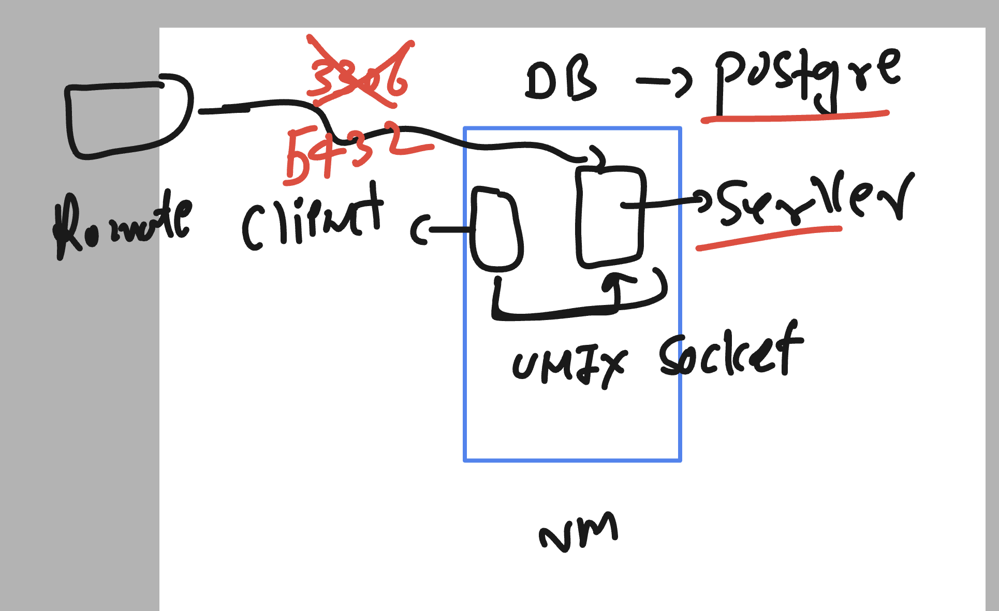
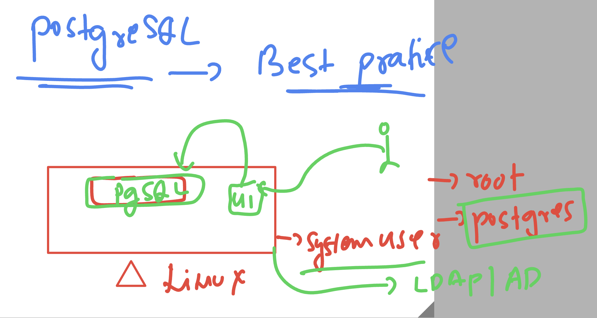
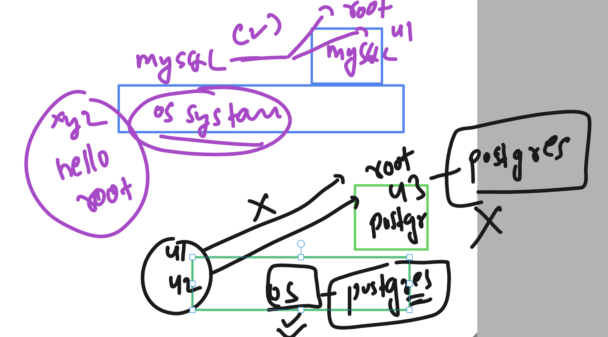

# fss-apache-training

## Postgresql info 

### documentation 

[click_here]('https://www.postgresql.org/docs/')

## Installing postgresql on RHEL 9 

### os version 

```
[root@ip-172-31-28-149 ~]# cat /etc/os-release 
NAME="Red Hat Enterprise Linux"
VERSION="9.2 (Plow)"
ID="rhel"
ID_LIKE="fedora"

```

### search for package of postgresql 

```
[root@ip-172-31-28-149 ~]# yum search  postgresql 
Updating Subscription Management repositories.
Unable to read consumer identity

This system is not registered with an entitlement server. You can use subscription-manager to register.

Red Hat Enterprise Linux 9 for x86_64 - AppStream from RHUI (RPMs)                                                            24 MB/s |  21 MB     00:00    
Red Hat Enterprise Linux 9 for x86_64 - BaseOS from RHUI (RPMs)                                                               17 MB/s |  12 MB     00:00    
Red Hat Enterprise Linux 9 Client Configuration                                                                               26 kB/s | 3.0 kB     00:00    
============================================================ Name & Summary Matched: postgresql =============================================================
postgresql.x86_64 : PostgreSQL client programs
pcp-pmda-postgresql.x86_64 : Performance Co-Pilot (PCP) metrics for PostgreSQL
postgresql-contrib.x86_64 : Extension modules distributed with PostgreSQL
postgresql-jdbc.noarch : JDBC driver for PostgreSQL
postgresql-odbc.x86_64 : PostgreSQL ODBC driver
postgresql-plperl.x86_64 : The Perl procedural language for PostgreSQL
postgresql-plpython3.x86_64 : The Python3 procedural language for PostgreSQL
postgresql-pltcl.x86_64 : The Tcl procedural language for PostgreSQL
postgresql-private-libs.x86_64 : The shared libraries required only for this build of PostgreSQL server
postgresql-server.x86_64 : The programs needed to create and run a PostgreSQL server
postgresql-upgrade.x86_64 : Support for upgrading from the previous major release of PostgreSQL
qt5-qtbase-postgresql.x86_64 : PostgreSQL driver for Qt5's SQL classes
qt5-qtbase-postgresql.i686 : PostgreSQL driver for Qt5's SQL classes
tuned-profiles-postgresql.noarch : Additional tuned profile(s) targeted to PostgreSQL server loads
==================================================
```

### Install postgresql 13 

```
[root@ip-172-31-28-149 ~]# dnf install postgresql-server
Updating Subscription Management repositories.
Unable to read consumer identity

This system is not registered with an entitlement server. You can use subscription-manager to register.

Last metadata expiration check: 0:03:35 ago on Fri 16 Jun 2023 10:52:03 AM UTC.
Dependencies resolved.
=============================================================================================================================================================
 Package                                    Architecture              Version                            Repository                                     Size
=============================================================================================================================================================
Installing:
 postgresql-server                          x86_64                    13.10-1.el9_1                      rhel-9-appstream-rhui-rpms                    5.8 M
Installing dependencies:
 libicu                                     x86_64                    67.1-9.el9                         rhel-9-baseos-rhui-rpms                       9.6 M
 postgresql                                 x86_64                    13.10-1.el9_1                      rhel-9-appstream-rhui-rpms                    1.6 M
 postgresql-private-libs               
```

### if want to install postgresql 15

```
dnf  module  install postgresql:15/server
```

## Initailize configuration 

```
[root@ip-172-31-28-149 ~]# postgresql-setup  --initdb 
 * Initializing database in '/var/lib/pgsql/data'
 * Initialized, logs are in /var/lib/pgsql/initdb_postgresql.log
[root@ip-172-31-28-149 ~]#  

```

### start the service

```
[root@ip-172-31-28-149 ~]# systemctl start postgresql 
[root@ip-172-31-28-149 ~]# systemctl status postgresql 
● postgresql.service - PostgreSQL database server
     Loaded: loaded (/usr/lib/systemd/system/postgresql.service; disabled; preset: disabled)
     Active: active (running) since Fri 2023-06-16 11:06:37 UTC; 6s ago
    Process: 14555 ExecStartPre=/usr/libexec/postg

root@ip-172-31-28-149 ~]# systemctl enable  postgresql 
Created symlink /etc/systemd/system/multi-user.target.wants/postgresql.service → /usr/lib/systemd/system/postgresql.service.
[root@ip-172-31-28-149 ~]# 


```

### understnading local and remote client connection 



### checking default port number 

```
[root@ip-172-31-28-149 ~]# ss -nltp
State         Recv-Q        Send-Q                 Local Address:Port                 Peer Address:Port        Process                                       
LISTEN        0             128                          0.0.0.0:22                        0.0.0.0:*            users:(("sshd",pid=969,fd=3))                
LISTEN        0             244                        127.0.0.1:5432                      0.0.0.0:*            users:(("postmaster",pid=14557,fd=
```

### Understading psql role with unix / linux system 

```
[root@ip-172-31-28-149 ~]# psql  
psql: error: FATAL:  role "root" does not exist
[root@ip-172-31-28-149 ~]# exit\
> ^C
[root@ip-172-31-28-149 ~]# exit
logout
[ec2-user@ip-172-31-28-149 ~]$ 
[ec2-user@ip-172-31-28-149 ~]$ whoami
ec2-user
[ec2-user@ip-172-31-28-149 ~]$ psql 
psql: error: FATAL:  role "ec2-user" does not exist
[ec2-user@ip-172-31-28-149 ~]$ sudo -i
[root@ip-172-31-28-149 ~]# grep -i postgres  /etc/passwd
postgres:x:26:26:PostgreSQL Server:/var/lib/pgsql:/bin/bash
[root@ip-172-31-28-149 ~]# 
[root@ip-172-31-28-149 ~]# 
[root@ip-172-31-28-149 ~]# su - postgres 
[postgres@ip-172-31-28-149 ~]$ 
[postgres@ip-172-31-28-149 ~]$ whoami
postgres
[postgres@ip-172-31-28-149 ~]$ psql 
psql (13.10)
Type "help" for help.

postgres=# \q
[postgres@ip-172-31-28-149 ~]$ 

```

### connecting from postgres system user to run psql command

```
[postgres@ip-172-31-28-149 ~]$ psql 
psql (13.10)
Type "help" for help.

postgres=# \conninfo 
You are connected to database "postgres" as user "postgres" via socket in "/var/run/postgresql" at port "5432".
postgres=# 


```

# POstgreSQL as per the best practice 



### installing and see the changes on system 

```
[root@ip-172-31-26-24 ~]# hostnamectl 
 Static hostname: ip-172-31-26-24.us-east-2.compute.internal
       Icon name: computer-vm
         Chassis: vm 🖴
      Machine ID: 81e4e09b3d3c463f8b45ba854caa3ed7
         Boot ID: 164dafb565e345539375c4345ab91836
  Virtualization: xen
Operating System: Red Hat Enterprise Linux 9.2 (Plow)       
     CPE OS Name: cpe:/o:redhat:enterprise_linux:9::baseos
          Kernel: Linux 5.14.0-284.11.1.el9_2.x86_64
    Architecture: x86-64
 Hardware Vendor: Xen
  Hardware Model: HVM domU
Firmware Version: 4.11.amazon
[root@ip-172-31-26-24 ~]# 
[root@ip-172-31-26-24 ~]# rpm -qa postgresql* 
[root@ip-172-31-26-24 ~]# 
[root@ip-172-31-26-24 ~]# 
[root@ip-172-31-26-24 ~]# grep -in postgres  /etc/passwd
[root@ip-172-31-26-24 ~]# 
[root@ip-172-31-26-24 ~]# dnf install postgresql-server -y  &>/dev/null 
[root@ip-172-31-26-24 ~]# rpm -qa postgresql* 
postgresql-private-libs-13.10-1.el9_1.x86_64
postgresql-13.10-1.el9_1.x86_64
postgresql-server-13.10-1.el9_1.x86_64
[root@ip-172-31-26-24 ~]# 
[root@ip-172-31-26-24 ~]# grep -in postgres  /etc/passwd
23:postgres:x:26:26:PostgreSQL Server:/var/lib/pgsql:/bin/bash
[root@ip-172-31-26-24 ~]# 

```

## Postgresql with user relation 



### initialize database by default profile

```
[root@ip-172-31-26-24 ~]# postgresql-setup   --initdb 
 * Initializing database in '/var/lib/pgsql/data'
 * Initialized, logs are in /var/lib/pgsql/initdb_postgresql.log
```


### checking more details

```
[root@ip-172-31-26-24 ~]# cd /var/lib/pgsql/
[root@ip-172-31-26-24 pgsql]# ls
backups  data  initdb_postgresql.log
[root@ip-172-31-26-24 pgsql]# tail -f initdb_postgresql.log 
selecting default time zone ... UTC
creating configuration files ... ok
running bootstrap script ... ok
performing post-bootstrap initialization ... ok
syncing data to disk ... ok

Success. You can now start the database server using:

    /usr/bin/pg_ctl -D /var/lib/pgsql/data -l logfile start

^C
[root@ip-172-31-26-24 pgsql]# ls
backups  data  initdb_postgresql.log
[root@ip-172-31-26-24 pgsql]# cd  data/
[root@ip-172-31-26-24 data]# ls
base    pg_commit_ts  pg_ident.conf  pg_notify    pg_snapshots  pg_subtrans  PG_VERSION  postgresql.auto.conf
global  pg_dynshmem   pg_logical     pg_replslot  pg_stat       pg_tblspc    pg_wal      postgresql.conf
log     pg_hba.conf   pg_multixact   pg_serial    pg_stat_tmp   pg_twophase  pg_xact
[root@ip-172-31-26-24 data]# 

```

### starting and enable service

```
[root@ip-172-31-26-24 data]# systemctl start postgresql.service 
[root@ip-172-31-26-24 data]# systemctl status  postgresql.service 
● postgresql.service - PostgreSQL database server
     Loaded: loaded (/usr/lib/systemd/system/postgresql.service; disabled; preset: disabled)
     Active: active (running) since Sat 2023-06-17 06:50:00 UTC; 6s ago
    Process: 14604 ExecStartPre=/usr/libexec/postgresql-check-db-dir postgresql (code=exited, status=0/SUCCESS)
   Main PID: 14606 (postmaster)
      Tasks: 8 (limit: 10863)
     Memory: 16.5M
        CPU: 48ms
     CGroup: /system.slice/postgresql.service
             ├─14606 /usr/bin/postmaster -D /var/lib/pgsql/data
             ├─14607 "postgres: logger "
             ├─14609 "postgres: checkpointer "
             ├─14610 "postgres: background writer "
             ├─14611 "postgres: walwriter "
             ├─14612 "postgres: autovacuum launcher "
             ├─14613 "postgres: stats collector "
             └─14614 "postgres: logical replication launcher "

Jun 17 06:50:00 ip-172-31-26-24.us-east-2.compute.internal systemd[1]: Starting PostgreSQL database server...
Jun 17 06:50:00 ip-172-31-26-24.us-east-2.compute.internal postmaster[14606]: 2023-06-17 06:50:00.400 UTC [14606] LOG:  redirecting log output to logging co>
Jun 17 06:50:00 ip-172-31-26-24.us-east-2.compute.internal postmaster[14606]: 2023-06-17 06:50:00.400 UTC [14606] HINT:  Future log output will appear in di>
Jun 17 06:50:00 ip-172-31-26-24.us-east-2.compute.internal systemd[1]: Started PostgreSQL database server.
[root@ip-172-31-26-24 data]# systemctl enable  postgresql.service 
```


